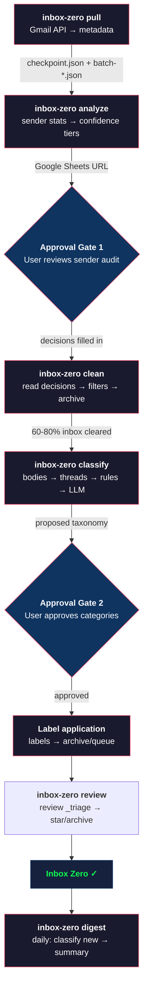
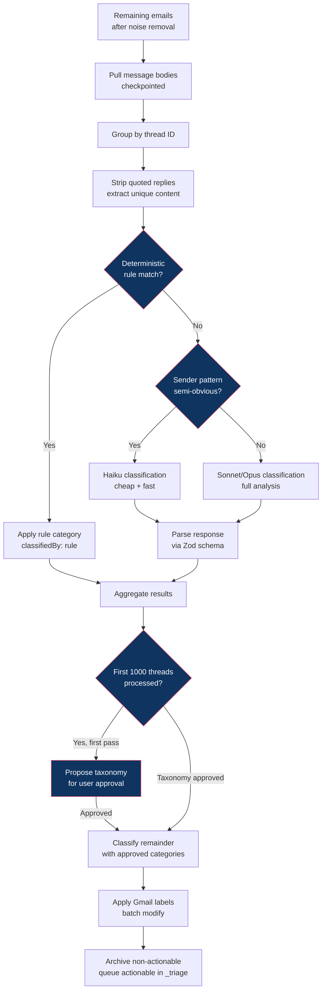
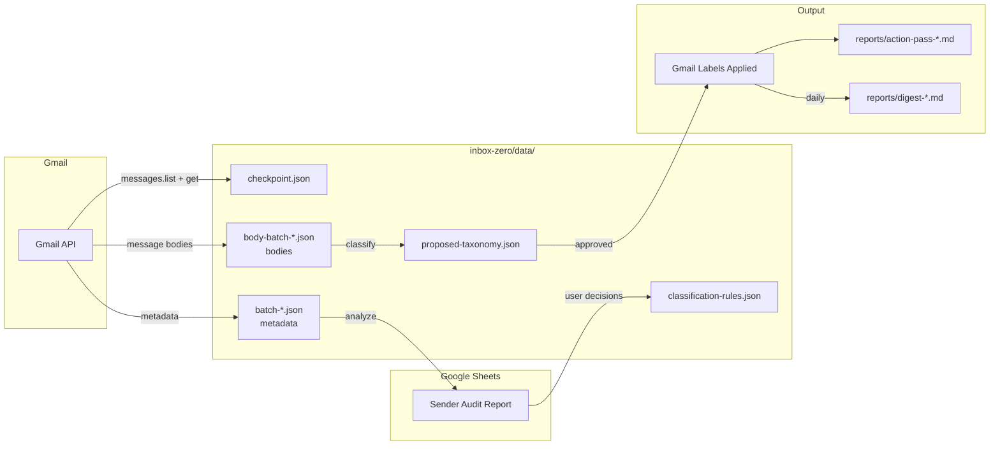

# Gmail Inbox Zero — Phase 1 Implementation Plan

> **For agentic workers:** REQUIRED: Use superpowers:subagent-driven-development (if subagents available) or superpowers:executing-plans to implement this plan. Steps use checkbox (`- [ ]`) syntax for tracking.

**Goal:** Build a TypeScript CLI toolchain that pulls 100k+ email metadata from Gmail, generates a sender audit in Google Sheets, executes noise removal, classifies remaining mail with deterministic rules + LLM, and maintains inbox zero with a daily digest. Use `googleapis` for the core maintained automation path; use `gws` opportunistically for ad-hoc/operator tasks where it simplifies the workflow.

**Repository:** `house-keeping`

**Architecture:** CLI tool with subcommands (`pull`, `analyze`, `clean`, `classify`, `review`, `digest`). Each subcommand maps to a spec workflow step. Shared Zod schemas define all data shapes. Gmail API client handles auth, rate limiting, and pagination. Checkpointing enables resumable long-running operations. `gws` is available as an operator helper for smoke tests, exploration, and one-off Workspace actions, but the production pipeline remains TypeScript-first and API-native.

**Tech Stack:** TypeScript (strict), Zod, Vitest, `googleapis`, Google Sheets API, Anthropic SDK (for LLM classification), Commander (CLI), optional `gws` CLI (`@googleworkspace/cli`) for manual/operator workflows

**Spec:** `docs/specs/2026-03-17-gmail-inbox-zero-design.md`

---

## Pipeline Overview



## Task Dependency Graph

```mermaid
flowchart LR
    T1[Task 1\nBootstrap] --> T2[Task 2\nSchemas: Email\n+ Checkpoint]
    T1 --> T3[Task 3\nSchemas: Sender\n+ Classification]
    T2 --> T4[Task 4\nGmail Client]
    T3 --> T4
    T4 --> T5[Task 5\nCheckpoint Mgr]
    T4 --> T6[Task 6\nMessage Parser]
    T5 --> T7[Task 7\nMetadata Puller]
    T6 --> T7
    T7 --> T8[Task 8\nSender Analyzer]
    T7 --> T9[Task 9\nConfidence Scorer]
    T8 --> T10[Task 10\nSheets Reporter]
    T9 --> T10
    T10 -->|⏸ Approval Gate 1| T11[Task 11\nSheets Reader\n+ Noise Removal]
    T11 --> T12[Task 12\nThread Collapser\n+ Body Puller]
    T12 --> T13[Task 13\nRule Engine]
    T12 --> T14[Task 14\nLLM Classifier]
    T13 --> T15[Task 15\nLabel Applier]
    T14 -->|⏸ Approval Gate 2| T15
    T15 --> T16[Task 16\nAction Pass\n+ CLI]
    T15 --> T17[Task 17\nDaily Digest]
    T16 --> T18[Task 18\nIntegration Test]
    T17 --> T18
    T18 --> T19[Task 19\nGit Init + Final]

    subgraph parallel1 [Parallelizable]
        T2
        T3
    end
    subgraph parallel2 [Parallelizable]
        T8
        T9
    end
    subgraph parallel3 [Parallelizable]
        T13
        T14
    end

    style T1 fill:#2d2d2d,stroke:#888,color:#fff
    style parallel1 fill:#1a1a2e,stroke:#e94560,color:#fff
    style parallel2 fill:#1a1a2e,stroke:#e94560,color:#fff
    style parallel3 fill:#1a1a2e,stroke:#e94560,color:#fff
```



## Classification Pipeline Detail



## Data Flow



---

## File Structure

```
inbox-zero/
  package.json
  tsconfig.json
  vitest.config.ts
  src/
    cli.ts                              # CLI entry point — Commander subcommands
    schemas/
      email-metadata.ts                 # Zod: Gmail message metadata shape
      checkpoint.ts                     # Zod: checkpoint state for resumable pulls
      sender-stats.ts                   # Zod: aggregated sender statistics
      classification.ts                 # Zod: LLM classification output
    auth/
      gmail-client.ts                   # Gmail API client — auth, rate limiting, retry
      sheets-client.ts                  # Google Sheets API client
    pull/
      metadata-puller.ts                # Checkpointed bulk metadata pull
      checkpoint-manager.ts             # Save/resume checkpoint state to disk
      message-parser.ts                 # Parse Gmail API response → EmailMetadata
    analysis/
      sender-analyzer.ts                # Aggregate metadata → sender stats
      confidence-scorer.ts              # Score senders into confidence tiers
      sheets-reporter.ts                # Write sender audit to Google Sheets
    noise/
      sheets-reader.ts                  # Read user decisions from Google Sheets
      filter-creator.ts                 # Create Gmail filters from decisions
      noise-remover.ts                  # Batch archive + label noise emails
    classify/
      thread-collapser.ts               # Group by thread, extract unique content
      rule-engine.ts                    # Deterministic sender/domain → category rules
      llm-classifier.ts                 # Provider-agnostic LLM classification
      body-puller.ts                    # Pull message bodies (checkpointed, like metadata)
      label-applier.ts                  # Create + apply Gmail labels
    review/
      action-pass.ts                    # Build actionable queue + finalize review decisions
    digest/
      daily-digest.ts                   # Classify new mail, generate summary
  tests/
    fixtures/
      sample-messages.ts                # Realistic test email metadata
      sample-gmail-response.ts          # Raw Gmail API response fixtures
    helpers/
      test-utils.ts                     # Shared test utilities (mock Gmail client, etc.)
    schemas/
      email-metadata.test.ts
      checkpoint.test.ts
      sender-stats.test.ts
      classification.test.ts
    pull/
      metadata-puller.test.ts
      checkpoint-manager.test.ts
      message-parser.test.ts
    analysis/
      sender-analyzer.test.ts
      confidence-scorer.test.ts
      sheets-reporter.test.ts
    noise/
      sheets-reader.test.ts
      filter-creator.test.ts
      noise-remover.test.ts
    classify/
      thread-collapser.test.ts
      rule-engine.test.ts
      llm-classifier.test.ts
      body-puller.test.ts
      label-applier.test.ts
    review/
      action-pass.test.ts
    digest/
      daily-digest.test.ts
```

### Design Decisions

- **One file per responsibility.** Each file has a single clear purpose and can be understood in isolation.
- **Schemas as the source of truth.** Every data shape is a Zod schema in `src/schemas/`. TypeScript types are derived via `z.infer<>`. All external data (Gmail API responses, checkpoint files, Sheets data) is parsed through Zod before use.
- **Auth clients are thin wrappers.** `gmail-client.ts` handles OAuth2, rate limiting, and retry. Everything else calls it — no direct `googleapis` usage outside this file.
- **CLI delegates to modules.** `cli.ts` is a thin Commander wrapper that parses args and calls the right module. Business logic lives in the modules.
- **`gws` is an operator tool, not a runtime dependency of the core pipeline.** Use it for smoke tests, exploratory queries, and one-off admin tasks where it removes setup friction. Do not make the maintained automation path depend on shelling out to `gws`.

---

## Task 1: Project Bootstrap

**Files:**
- Create: `inbox-zero/package.json`
- Create: `inbox-zero/tsconfig.json`
- Create: `inbox-zero/vitest.config.ts`
- Create: `inbox-zero/.env.example`

- [ ] **Step 1: Initialize npm project**

```bash
cd inbox-zero
npm init -y
```

- [ ] **Step 2: Install dependencies**

```bash
npm install googleapis zod commander @anthropic-ai/sdk
npm install -D typescript vitest @types/node tsx
```

Optional operator helper:
```bash
gws --version
```

If `gws` is available locally, it can be used for ad-hoc Workspace checks during development. Do not add it as a runtime dependency of the core CLI.

- [ ] **Step 3: Create tsconfig.json**

```json
{
  "compilerOptions": {
    "target": "ES2022",
    "module": "NodeNext",
    "moduleResolution": "NodeNext",
    "strict": true,
    "noUncheckedIndexedAccess": true,
    "esModuleInterop": true,
    "outDir": "dist",
    "rootDir": "src",
    "declaration": true,
    "sourceMap": true,
    "skipLibCheck": true
  },
  "include": ["src/**/*"],
  "exclude": ["node_modules", "dist"]
}
```

- [ ] **Step 4: Create vitest.config.ts**

```typescript
import { defineConfig } from "vitest/config";

export default defineConfig({
  test: {
    globals: true,
    include: ["tests/**/*.test.ts"],
  },
});
```

- [ ] **Step 5: Create .env.example**

```
# Gmail API — uses gcloud application default credentials for the maintained automation pipeline
# Run: gcloud auth application-default login --scopes=https://www.googleapis.com/auth/gmail.modify,https://www.googleapis.com/auth/gmail.settings.basic,https://www.googleapis.com/auth/spreadsheets
GOOGLE_CLOUD_PROJECT=your-gcp-project

# Google Sheets — audit report spreadsheet ID (created by analyze command)
AUDIT_SHEET_ID=

# Anthropic — for LLM classification step
ANTHROPIC_API_KEY=

# Data directory (defaults to ./data)
DATA_DIR=./data

# Optional operator helper: `gws` may reuse local Workspace auth for ad-hoc/manual checks
```

- [ ] **Step 6: Add scripts to package.json**

Add to `package.json`:
```json
{
  "type": "module",
  "scripts": {
    "build": "tsc",
    "test": "vitest run",
    "test:watch": "vitest",
    "cli": "tsx src/cli.ts"
  }
}
```

- [ ] **Step 7: Commit**

```bash
git add package.json tsconfig.json vitest.config.ts .env.example
git commit -m "chore(inbox-zero): scaffold TS project with Zod, Vitest, googleapis"
```

---

## Task 2: Zod Schemas — Email Metadata & Checkpoint

**Files:**
- Create: `inbox-zero/src/schemas/email-metadata.ts`
- Create: `inbox-zero/src/schemas/checkpoint.ts`
- Create: `inbox-zero/tests/schemas/email-metadata.test.ts`
- Create: `inbox-zero/tests/schemas/checkpoint.test.ts`
- Create: `inbox-zero/tests/fixtures/sample-messages.ts`

- [ ] **Step 1: Write email metadata schema tests**

Test file: `tests/schemas/email-metadata.test.ts`

Test cases:
- Valid metadata parses successfully (all fields present)
- Minimal metadata parses (optional fields omitted)
- Invalid sender email rejects
- Missing required fields (messageId, threadId, sender, dateReceived) reject
- `gmailCategory` validates against enum: `primary | social | promotions | updates | forums | unknown`
- `isUnread` is required boolean

- [ ] **Step 2: Run tests, verify they fail**

Run: `npm test -- tests/schemas/email-metadata.test.ts`
Expected: FAIL — module not found

- [ ] **Step 3: Implement email metadata schema**

File: `src/schemas/email-metadata.ts`

```typescript
import { z } from "zod";

export const GmailCategorySchema = z.enum([
  "primary",
  "social",
  "promotions",
  "updates",
  "forums",
  "unknown",
]).describe("Gmail tab category");

export const EmailMetadataSchema = z.object({
  messageId: z.string().min(1).describe("Gmail message ID"),
  threadId: z.string().min(1).describe("Gmail thread ID"),
  sender: z.object({
    email: z.string().email().describe("Sender email address"),
    name: z.string().default("").describe("Sender display name"),
  }),
  recipients: z.object({
    to: z.array(z.string().email()).default([]),
    cc: z.array(z.string().email()).default([]),
  }).default({}),
  subject: z.string().default("(no subject)"),
  dateReceived: z.coerce.date().describe("Date email was received"),
  gmailCategory: GmailCategorySchema.default("unknown"),
  labels: z.array(z.string()).default([]),
  isUnread: z.boolean().describe("Whether the email is unread"),
  snippet: z.string().default("").describe("First ~100 chars of body"),
});

export type EmailMetadata = z.infer<typeof EmailMetadataSchema>;
```

- [ ] **Step 4: Run tests, verify they pass**

Run: `npm test -- tests/schemas/email-metadata.test.ts`
Expected: PASS

- [ ] **Step 5: Write checkpoint schema tests**

Test file: `tests/schemas/checkpoint.test.ts`

Test cases:
- Valid checkpoint with `status: "in_progress"`, `pageToken`, `messagesFetched`, `lastSavedAt` parses
- Valid checkpoint with `status: "complete"` and no `pageToken` parses
- `status` must be `in_progress | complete | failed`
- `messagesFetched` must be non-negative integer
- `lastSavedAt` coerces from ISO string to Date

- [ ] **Step 6: Implement checkpoint schema**

File: `src/schemas/checkpoint.ts`

```typescript
import { z } from "zod";

export const CheckpointStatusSchema = z.enum(["in_progress", "complete", "failed"]);

export const CheckpointSchema = z.object({
  status: CheckpointStatusSchema,
  query: z.string().describe("Gmail query used for this pull"),
  pageToken: z.string().nullable().default(null).describe("Next page token for resume"),
  messagesFetched: z.number().int().nonneg().describe("Total messages fetched so far"),
  batchesSaved: z.number().int().nonneg().describe("Number of checkpoint batches written"),
  lastSavedAt: z.coerce.date().describe("Timestamp of last checkpoint save"),
  errors: z.array(z.object({
    timestamp: z.coerce.date(),
    message: z.string(),
    pageToken: z.string().nullable(),
  })).default([]).describe("Errors encountered during pull"),
});

export type Checkpoint = z.infer<typeof CheckpointSchema>;
```

- [ ] **Step 7: Run all schema tests**

Run: `npm test -- tests/schemas/`
Expected: PASS

- [ ] **Step 8: Create test fixtures**

File: `tests/fixtures/sample-messages.ts`

Create 5-10 realistic `EmailMetadata` objects representing:
- A newsletter (promotions, unread, noreply sender)
- A personal email (primary, read, human sender)
- A financial notification (updates, recent)
- A social notification (social, unread)
- A tax-related email (primary, specific sender domain like irs.gov)
- A property management email (primary, multi-thread history)

These fixtures are reused across all test files.

- [ ] **Step 9: Commit**

```bash
git add src/schemas/ tests/schemas/ tests/fixtures/
git commit -m "feat(inbox-zero): add Zod schemas for email metadata and checkpointing"
```

---

## Task 3: Zod Schemas — Sender Stats & Classification

**Files:**
- Create: `inbox-zero/src/schemas/sender-stats.ts`
- Create: `inbox-zero/src/schemas/classification.ts`
- Create: `inbox-zero/tests/schemas/sender-stats.test.ts`
- Create: `inbox-zero/tests/schemas/classification.test.ts`

- [ ] **Step 1: Write sender stats schema tests**

Test cases:
- Valid sender stats with all audit columns parses
- `confidenceTier` validates against enum: `definitely_noise | probably_noise | probably_keep | definitely_keep`
- `recommendedAction` validates against enum: `keep | filter | unsubscribe`
- `unreadRatio` must be between 0 and 1
- `sampleSubjects` is array of strings, max 5

- [ ] **Step 2: Implement sender stats schema**

File: `src/schemas/sender-stats.ts`

Matches the Google Sheets audit columns from the spec exactly:
- `senderEmail`, `senderName`, `emailCount`, `firstEmailDate`, `lastEmailDate`
- `gmailCategory`, `unreadRatio`, `threadCount`
- `sampleSubjects`, `confidenceTier`, `recommendedAction`, `surprisesFlag`, `userDecision`

- [ ] **Step 3: Write classification schema tests**

Test cases:
- Valid classification with category, confidence, actionable flag, summary parses
- `confidence` must be between 0 and 1
- `actionable` is boolean
- `category` is a non-empty string (data-driven, not enum)
- `threadId` is required

- [ ] **Step 4: Implement classification schema**

File: `src/schemas/classification.ts`

```typescript
import { z } from "zod";

export const ThreadClassificationSchema = z.object({
  threadId: z.string().min(1),
  category: z.string().min(1).describe("Data-driven category — not pre-defined"),
  confidence: z.number().min(0).max(1),
  actionable: z.boolean().describe("Within 12-month window and needs response"),
  summary: z.string().max(500).describe("1-2 sentence summary"),
  classifiedBy: z.enum(["rule", "llm"]).describe("Whether rule engine or LLM classified this"),
  ruleName: z.string().optional().describe("Name of rule if classified by rule engine"),
});

export type ThreadClassification = z.infer<typeof ThreadClassificationSchema>;
```

- [ ] **Step 5: Run all schema tests, verify pass**

Run: `npm test -- tests/schemas/`

- [ ] **Step 6: Commit**

```bash
git add src/schemas/ tests/schemas/
git commit -m "feat(inbox-zero): add Zod schemas for sender stats and classification"
```

---

## Task 4: Gmail Auth Client

**Files:**
- Create: `inbox-zero/src/auth/gmail-client.ts`
- Create: `inbox-zero/tests/auth/gmail-client.test.ts`
- Create: `inbox-zero/tests/helpers/test-utils.ts`

- [ ] **Step 1: Write gmail client tests**

Test cases:
- `createGmailClient()` returns a wrapper exposing `listMessages`, `getMessage`, `batchModifyMessages`, `listLabels`, `createLabel`, `createFilter`, `getProfile`
- Rate limiter respects configured QPS (test with mock clock)
- Retry logic retries on 429 (rate limit) and 503 (service unavailable) up to max retries
- Retry logic does NOT retry on 401 (auth) or 400 (bad request)
- `getProfile()` returns email address and total messages (smoke test shape)

**Important:** Tests must mock the `googleapis` client. Create a shared mock factory in `tests/helpers/test-utils.ts` that returns a mock Gmail client with configurable responses.

- [ ] **Step 2: Create test utilities**

File: `tests/helpers/test-utils.ts`

```typescript
import type { gmail_v1 } from "googleapis";

export function createMockGmailClient(overrides?: Partial<gmail_v1.Gmail>): gmail_v1.Gmail {
  // Return a mock Gmail client with jest/vitest mock functions
  // Default: all methods resolve with empty responses
  // Overrides allow per-test customization
}

export function createMockSheetsClient(): sheets_v4.Sheets {
  // Similar mock for Sheets API
}
```

- [ ] **Step 3: Implement gmail client**

File: `src/auth/gmail-client.ts`

Key implementation details:
- Use `google.auth.getApplicationDefault()` — leverages existing gcloud credentials
- Wrap in rate limiter: max 10 QPS for Gmail API (configurable)
- Retry with exponential backoff: retry on 429/503, max 5 retries, initial delay 1s
- Export a `GmailClient` class that wraps `gmail_v1.Gmail` with rate limiting and retry
- Filter creation requires `gmail.settings.basic` in addition to `gmail.modify`; the smoke test must verify both read/write and settings access
- Manual smoke checks may use `gws` for fast comparison, but the maintained auth path and implementation stay on `googleapis`
- All methods return `Result<T>` pattern (`{ ok: true, value } | { ok: false, error }`)

- [ ] **Step 4: Run tests, verify pass**

Run: `npm test -- tests/auth/gmail-client.test.ts`

- [ ] **Step 5: Write auth smoke test script**

Create a simple script that can be run manually to verify auth works:

File: `src/auth/smoke-test.ts`

```typescript
// Run with: npx tsx src/auth/smoke-test.ts
// Should print: "Authenticated as: you@example.com, Total messages: XXXXX"
```

- [ ] **Step 6: Commit**

```bash
git add src/auth/ tests/auth/ tests/helpers/
git commit -m "feat(inbox-zero): Gmail API client with rate limiting and retry"
```

---

## Task 5: Checkpoint Manager

**Files:**
- Create: `inbox-zero/src/pull/checkpoint-manager.ts`
- Create: `inbox-zero/tests/pull/checkpoint-manager.test.ts`

- [ ] **Step 1: Write checkpoint manager tests**

Test cases:
- `saveCheckpoint()` writes JSON to `data/checkpoint.json` with valid `CheckpointSchema` shape
- `loadCheckpoint()` reads and parses existing checkpoint, returns `Result<Checkpoint>`
- `loadCheckpoint()` returns `{ ok: false }` when no checkpoint file exists (fresh start)
- `saveBatch()` writes a batch of `EmailMetadata[]` to `data/batch-{N}.json`
- `saveBatch()` increments `batchesSaved` and `messagesFetched` in checkpoint
- `loadAllBatches()` reads all batch files and returns combined `EmailMetadata[]`
- Corrupt checkpoint file returns `{ ok: false }` with descriptive error
- Checkpoint atomicity: writes to temp file first, renames on success (no partial writes)

- [ ] **Step 2: Run tests, verify they fail**

- [ ] **Step 3: Implement checkpoint manager**

File: `src/pull/checkpoint-manager.ts`

Key details:
- `BATCH_SIZE = 500` (configurable, matches spec)
- Checkpoint file: `{dataDir}/checkpoint.json`
- Batch files: `{dataDir}/batch-{N:05d}.json` (zero-padded for sort order)
- Atomic writes: write to `.tmp` file, then `fs.rename()` — prevents corruption on crash
- All disk I/O wrapped in try-catch, returns `Result<T>`

- [ ] **Step 4: Run tests, verify pass**

- [ ] **Step 5: Commit**

```bash
git add src/pull/checkpoint-manager.ts tests/pull/checkpoint-manager.test.ts
git commit -m "feat(inbox-zero): checkpoint manager with atomic writes and resume"
```

---

## Task 6: Message Parser

**Files:**
- Create: `inbox-zero/src/pull/message-parser.ts`
- Create: `inbox-zero/tests/pull/message-parser.test.ts`
- Create: `inbox-zero/tests/fixtures/sample-gmail-response.ts`

- [ ] **Step 1: Write message parser tests**

Test cases:
- Parses a Gmail API `messages.get` metadata response into `EmailMetadata`
- Extracts sender email and name from `From` header (handles `"Name <email>"` format)
- Extracts recipients from `To` and `Cc` headers
- Extracts subject from `Subject` header, defaults to `"(no subject)"`
- Detects Gmail category from `labelIds` (`CATEGORY_PROMOTIONS` → `"promotions"`)
- Detects `isUnread` from `UNREAD` in `labelIds`
- Extracts `snippet` from response
- Handles malformed headers gracefully (returns defaults, doesn't throw)
- Handles metadata-format payloads where only headers are present

- [ ] **Step 2: Create Gmail API response fixtures**

File: `tests/fixtures/sample-gmail-response.ts`

Create realistic raw Gmail API metadata response objects matching the shape of `gmail_v1.Schema$Message`. Include examples with various header formats, category labels, and snippets.

- [ ] **Step 3: Implement message parser**

File: `src/pull/message-parser.ts`

Key details:
- Export `parseGmailMessage(raw: gmail_v1.Schema$Message): Result<EmailMetadata>`
- Extract headers by name from `payload.headers[]`
- Parse `From` header with regex: `/^(.+?)\s*<(.+?)>$/` with bounded quantifiers per security standards
- Map `CATEGORY_*` labelIds to `GmailCategory` enum values
- Do not infer attachment presence in this parser; metadata-only pulls do not expose enough information for a reliable `hasAttachment` field
- Input truncation before any regex processing (security standard)

- [ ] **Step 4: Run tests, verify pass**

- [ ] **Step 5: Commit**

```bash
git add src/pull/message-parser.ts tests/pull/message-parser.test.ts tests/fixtures/sample-gmail-response.ts
git commit -m "feat(inbox-zero): Gmail API response parser with header extraction"
```

---

## Task 7: Metadata Puller

**Files:**
- Create: `inbox-zero/src/pull/metadata-puller.ts`
- Create: `inbox-zero/tests/pull/metadata-puller.test.ts`

- [ ] **Step 1: Write metadata puller tests**

Test cases:
- `pull()` fetches messages using correct query (`in:anywhere -in:spam -in:trash -in:drafts -in:sent`)
- `pull()` paginates through all pages using `nextPageToken`
- `pull()` saves a checkpoint every `BATCH_SIZE` messages
- `pull()` resumes from existing checkpoint (uses saved `pageToken`)
- `pull()` handles rate limit errors (429) via client retry
- `pull()` records errors in checkpoint and continues
- `pull()` sets checkpoint status to `complete` when no more pages
- Dry-run mode: fetches first page only, logs count, does not save data
- Progress callback fires with `{ fetched, total, batchesSaved }` after each batch

Mock the Gmail client to return paginated results across 3 pages.

- [ ] **Step 2: Implement metadata puller**

File: `src/pull/metadata-puller.ts`

Key details:
- Uses `gmail.users.messages.list()` for message IDs, then `gmail.users.messages.get()` for metadata
- `messages.get` with `format: "metadata"` and `metadataHeaders: ["From", "To", "Cc", "Subject"]` — minimizes response size
- Processes in batches of `BATCH_SIZE` — fetch IDs, get metadata with bounded concurrency, parse, save checkpoint
- `onProgress` callback for CLI progress reporting
- `dryRun` flag: fetches one page, reports estimated total, exits
- Attachment-related signals are intentionally deferred until the smaller body-pull phase after noise removal

- [ ] **Step 3: Run tests, verify pass**

- [ ] **Step 4: Commit**

```bash
git add src/pull/metadata-puller.ts tests/pull/metadata-puller.test.ts
git commit -m "feat(inbox-zero): checkpointed metadata puller with dry-run and progress"
```

---

## Task 8: Sender Analyzer

**Files:**
- Create: `inbox-zero/src/analysis/sender-analyzer.ts`
- Create: `inbox-zero/tests/analysis/sender-analyzer.test.ts`

- [ ] **Step 1: Write sender analyzer tests**

Test cases:
- Aggregates 100 emails from 10 senders into 10 `SenderStats` objects
- `emailCount` sums correctly per sender
- `firstEmailDate` and `lastEmailDate` are correct min/max
- `unreadRatio` = unread count / total count per sender
- `threadCount` counts distinct threadIds per sender
- `sampleSubjects` picks up to 5 most recent distinct subjects
- `gmailCategory` uses the most common category for that sender
- Handles empty input (returns empty array)
- Handles senders with identical email but different display names (normalizes by email)

- [ ] **Step 2: Implement sender analyzer**

File: `src/analysis/sender-analyzer.ts`

Key details:
- Input: `EmailMetadata[]` (loaded from all batch files)
- Output: `SenderStats[]` sorted by `emailCount` descending
- Use `Map<string, SenderAccumulator>` keyed by lowercase sender email
- Sender analyzer is intentionally computed from received-mail metadata only; do not derive reply/attachment signals here

- [ ] **Step 3: Run tests, verify pass**

- [ ] **Step 4: Commit**

```bash
git add src/analysis/sender-analyzer.ts tests/analysis/sender-analyzer.test.ts
git commit -m "feat(inbox-zero): sender frequency analyzer for metadata-only audit"
```

---

## Task 9: Confidence Scorer

**Files:**
- Create: `inbox-zero/src/analysis/confidence-scorer.ts`
- Create: `inbox-zero/tests/analysis/confidence-scorer.test.ts`

- [ ] **Step 1: Write confidence scorer tests**

Test cases:
- noreply@ sender + Promotions category + 100% unread → `definitely_noise`, recommend `unsubscribe`
- High unread ratio + Social category + low thread count → `probably_noise`, recommend `filter`
- Primary category + low unread + recent activity → `probably_keep`, recommend `keep`
- Low unread + recent activity + multi-thread history → `definitely_keep`, recommend `keep`
- High-volume sender in Primary with high unread → `surprisesFlag = true` (unexpected pattern)
- Edge case: sender with 1 email (not enough signal) → `probably_keep` (conservative)

- [ ] **Step 2: Implement confidence scorer**

File: `src/analysis/confidence-scorer.ts`

Key details:
- Input: `SenderStats` (without `confidenceTier`/`recommendedAction` fields)
- Output: `SenderStats` with those fields populated
- Scoring logic uses weighted signals: unreadRatio (0.4), gmailCategory (0.25), recency (0.2), threadCount (0.15)
- Hard overrides for clear cases: `noreply@`, newsletter platforms, and known marketing domains can short-circuit to noise tiers
- Thresholds for tiers are configurable constants with JSDoc explaining each
- Surprise detection: flags senders where category and engagement signals disagree

- [ ] **Step 3: Run tests, verify pass**

- [ ] **Step 4: Commit**

```bash
git add src/analysis/confidence-scorer.ts tests/analysis/confidence-scorer.test.ts
git commit -m "feat(inbox-zero): confidence scorer with weighted signals and surprise detection"
```

---

## Task 10: Google Sheets Reporter

**Files:**
- Create: `inbox-zero/src/auth/sheets-client.ts`
- Create: `inbox-zero/src/analysis/sheets-reporter.ts`
- Create: `inbox-zero/tests/analysis/sheets-reporter.test.ts`

- [ ] **Step 1: Write sheets reporter tests**

Test cases:
- `createAuditSheet()` creates a new spreadsheet with correct title and header row
- `writeAuditData()` writes `SenderStats[]` rows matching the spec's column order
- Header row matches spec columns exactly (13 columns)
- Data rows format dates as `YYYY-MM-DD`, ratios as percentages, booleans as Yes/No
- `sampleSubjects` array joined with ` | ` separator
- Sheet is formatted: header row bold, frozen, auto-filter enabled
- Returns the spreadsheet URL for user to open

- [ ] **Step 2: Implement sheets client**

File: `src/auth/sheets-client.ts`

Thin wrapper around Google Sheets API using same `getApplicationDefault()` auth as Gmail client. Methods: `createSpreadsheet()`, `writeRows()`, `readRows()`, `formatSheet()`.

- [ ] **Step 3: Implement sheets reporter**

File: `src/analysis/sheets-reporter.ts`

Key details:
- Creates spreadsheet titled `"Gmail Audit — {date}"`
- Writes header row + data rows
- Formats: freeze row 1, bold headers, auto-resize columns, add data validation for "Your decision" column (dropdown: keep/filter/unsubscribe)
- Returns `{ spreadsheetId, spreadsheetUrl }`

- [ ] **Step 4: Run tests, verify pass**

- [ ] **Step 5: Commit**

```bash
git add src/auth/sheets-client.ts src/analysis/sheets-reporter.ts tests/analysis/sheets-reporter.test.ts
git commit -m "feat(inbox-zero): Google Sheets audit reporter with formatting"
```

---

## Task 11: Google Sheets Reader + Noise Removal

**Files:**
- Create: `inbox-zero/src/noise/sheets-reader.ts`
- Create: `inbox-zero/src/noise/filter-creator.ts`
- Create: `inbox-zero/src/noise/noise-remover.ts`
- Create: `inbox-zero/tests/noise/sheets-reader.test.ts`
- Create: `inbox-zero/tests/noise/filter-creator.test.ts`
- Create: `inbox-zero/tests/noise/noise-remover.test.ts`

- [ ] **Step 1: Write sheets reader tests**

Test cases:
- Reads "Your decision" column and returns `Map<senderEmail, "keep" | "filter" | "unsubscribe">`
- Skips rows where decision is empty
- Case-insensitive decision parsing (`Keep`, `KEEP`, `keep` all work)
- Returns error for invalid decision values

- [ ] **Step 2: Implement sheets reader**

File: `src/noise/sheets-reader.ts`

- [ ] **Step 3: Write filter creator tests**

Test cases:
- `createFilter()` calls Gmail API `users.settings.filters.create` with correct criteria (`from: sender`)
- Filter action: skip inbox + apply `_noise` label + mark read (for `unsubscribe` senders)
- Filter action: skip inbox + apply `_noise` label (for `filter` senders)
- `createNoiseLabel()` creates `_noise` label if it doesn't exist, returns label ID
- Batch creation: processes array of senders, returns success/failure per sender
- Dry-run mode: logs what would be created without calling API

- [ ] **Step 4: Implement filter creator**

File: `src/noise/filter-creator.ts`

Key details:
- Uses Gmail `users.settings.filters.create`, so this task depends on the auth scope updated in Task 1 / Task 4

- [ ] **Step 5: Write noise remover tests**

Test cases:
- `archiveNoiseSenders()` searches for emails from noise senders and batch-modifies: remove INBOX label, add `_noise` label
- Uses Gmail `batchModify` for efficiency (up to 1000 message IDs per call)
- Progress callback reports `{ sender, messagesArchived, totalSenders, currentSender }`
- Handles partial failures (some senders fail, others succeed)
- Returns summary: `{ totalArchived, failures }`

- [ ] **Step 6: Implement noise remover**

File: `src/noise/noise-remover.ts`

- [ ] **Step 7: Run all noise tests, verify pass**

Run: `npm test -- tests/noise/`

- [ ] **Step 8: Commit**

```bash
git add src/noise/ tests/noise/
git commit -m "feat(inbox-zero): noise removal pipeline — read decisions, create filters, batch archive"
```

---

## Task 12: Thread Collapser + Body Puller

**Files:**
- Create: `inbox-zero/src/classify/thread-collapser.ts`
- Create: `inbox-zero/src/classify/body-puller.ts`
- Create: `inbox-zero/tests/classify/thread-collapser.test.ts`
- Create: `inbox-zero/tests/classify/body-puller.test.ts`

- [ ] **Step 1: Write thread collapser tests**

Test cases:
- Groups 10 messages with 3 unique threadIds into 3 thread groups
- Each thread group contains messages sorted by date ascending
- `extractUniqueContent()` strips quoted reply patterns (`>`, `On ... wrote:`, `------`)
- Quoted reply stripping handles common patterns: Gmail, Outlook, Apple Mail
- Thread summary includes: threadId, sender of first message, subject, participant list, date range, concatenated unique content
- Handles single-message threads (no stripping needed)
- Regex quantifiers in quoted-reply patterns are bounded (security standard)

- [ ] **Step 2: Implement thread collapser**

File: `src/classify/thread-collapser.ts`

- [ ] **Step 3: Write body puller tests**

Test cases:
- `pullBodies()` fetches full message content for given message IDs
- Uses `format: "full"` to get body content
- Extracts plain text from `text/plain` part, falls back to `text/html` with HTML stripping
- Checkpointed: saves progress every batch, can resume
- Respects rate limits via Gmail client

- [ ] **Step 4: Implement body puller**

File: `src/classify/body-puller.ts`

Reuses checkpoint manager pattern from Task 5. Separate checkpoint file: `data/body-checkpoint.json`.

- [ ] **Step 5: Run tests, verify pass**

- [ ] **Step 6: Commit**

```bash
git add src/classify/thread-collapser.ts src/classify/body-puller.ts tests/classify/
git commit -m "feat(inbox-zero): thread collapser and checkpointed body puller"
```

---

## Task 13: Rule Engine

**Files:**
- Create: `inbox-zero/src/classify/rule-engine.ts`
- Create: `inbox-zero/tests/classify/rule-engine.test.ts`

- [ ] **Step 1: Write rule engine tests**

Test cases:
- Domain rule: `chase.com` → `financial` classifies correctly
- Domain rule: `irs.gov` → `tax` classifies correctly
- Exact sender rule: `landlord@example.com` → `rental` classifies correctly
- Rules loaded from JSON config file (not hardcoded)
- Unmatched sender returns `null` (passes to LLM)
- Rule priority: exact sender match beats domain match
- `classifiedBy: "rule"` and `ruleName` are set in output
- Empty rules config returns `null` for everything
- `buildRulesTemplateFromAudit()` generates starter sender/domain candidates with `null` categories for manual curation
- Blank/null category rules are ignored until the user fills them in

- [ ] **Step 2: Implement rule engine**

File: `src/classify/rule-engine.ts`

Key details:
- Rules stored in `data/classification-rules.json`
- Schema: `{ domainRules: Record<domain, category | null>, senderRules: Record<email, category | null> }`
- `classify(threadSummary): ThreadClassification | null` — returns null if no rule matches
- `buildRulesTemplateFromAudit(senderStats[])` — bootstraps likely sender/domain keys from keep senders, but leaves categories blank for user curation before classification runs.

- [ ] **Step 3: Run tests, verify pass**

- [ ] **Step 4: Commit**

```bash
git add src/classify/rule-engine.ts tests/classify/rule-engine.test.ts
git commit -m "feat(inbox-zero): deterministic rule engine with config-driven classification"
```

---

## Task 14: LLM Classifier

**Files:**
- Create: `inbox-zero/src/classify/llm-classifier.ts`
- Create: `inbox-zero/tests/classify/llm-classifier.test.ts`

- [ ] **Step 1: Write LLM classifier tests**

Test cases:
- `classify()` sends thread content to Anthropic API with classification prompt
- Response parsed into `ThreadClassification` via Zod
- Provider-agnostic: accepts a `ClassificationProvider` interface (not hardcoded to Anthropic)
- `AnthropicProvider` implements the interface using `@anthropic-ai/sdk`
- Batch classification: processes N threads, returns `ThreadClassification[]`
- Handles LLM returning unexpected format (Zod parse failure → log error, mark as `uncategorized`)
- `actionable` flag only set `true` if thread's most recent message is within 12-month window
- Rate limiting: max concurrent requests configurable
- `proposeTaxonomy(sampleThreads)` — sends first 1000 threads to LLM, asks it to propose categories. Returns `string[]` of proposed category names.

- [ ] **Step 2: Implement LLM classifier**

File: `src/classify/llm-classifier.ts`

Key details:
- `ClassificationProvider` interface: `classify(content: string, existingCategories: string[]): Promise<Result<ThreadClassification>>`
- `AnthropicProvider` class uses `@anthropic-ai/sdk` with model parameter (default: `claude-haiku-4-5-20251001` for bulk, `claude-sonnet-4-6` for ambiguous)
- Classification prompt includes: thread content, existing approved categories (to maintain consistency), instruction to return JSON matching `ThreadClassificationSchema`
- `proposeTaxonomy()` sends a representative sample and asks for suggested categories with reasoning

- [ ] **Step 3: Run tests, verify pass**

- [ ] **Step 4: Commit**

```bash
git add src/classify/llm-classifier.ts tests/classify/llm-classifier.test.ts
git commit -m "feat(inbox-zero): provider-agnostic LLM classifier with taxonomy proposal"
```

---

## Task 15: Label Applier

**Files:**
- Create: `inbox-zero/src/classify/label-applier.ts`
- Create: `inbox-zero/tests/classify/label-applier.test.ts`

- [ ] **Step 1: Write label applier tests**

Test cases:
- `ensureLabelsExist()` creates Gmail labels for each category in the approved taxonomy
- `applyClassifications()` batch-modifies messages: adds category label to every classified message
- Uses `batchModify` for efficiency (up to 1000 IDs per call)
- Non-actionable messages are archived when labels are applied
- Actionable messages get their category label plus `_triage` and remain in inbox for Task 16 review
- Creates `_triage` and `_extracted` operational labels if they don't exist
- Dry-run mode: logs what would be applied without calling API
- Progress callback: `{ applied, total }`

- [ ] **Step 2: Implement label applier**

File: `src/classify/label-applier.ts`

Key details:
- Apply category labels to all classified messages
- Remove `INBOX` immediately only for non-actionable/reference messages
- Add `_triage` to actionable messages and leave them in inbox until reviewed

- [ ] **Step 3: Run tests, verify pass**

- [ ] **Step 4: Commit**

```bash
git add src/classify/label-applier.ts tests/classify/label-applier.test.ts
git commit -m "feat(inbox-zero): Gmail label creation and batch application"
```

---

## Task 16: Action Pass + CLI Entry Point

**Files:**
- Create: `inbox-zero/src/review/action-pass.ts`
- Create: `inbox-zero/tests/review/action-pass.test.ts`
- Create: `inbox-zero/src/cli.ts`

- [ ] **Step 1: Write action pass tests**

Test cases:
- `buildActionReport()` groups `_triage` messages by category and writes `reports/action-pass-{YYYY-MM-DD}.md`
- `finalizeReview()` stars messages explicitly marked for follow-up, archives the rest, and removes `_triage`
- Dry-run mode reports intended star/archive changes without calling Gmail
- Empty `_triage` queue produces a report saying there is nothing to review

- [ ] **Step 2: Implement action pass module**

File: `src/review/action-pass.ts`

Key details:
- Reads actionable messages already labeled with `_triage`
- Generates a human-reviewable markdown report grouped by category
- Accepts explicit review decisions (`star` or `archive`) and applies them in batch
- Removing `_triage` is the finalization step that makes inbox zero true for reviewed actionable mail

- [ ] **Step 3: Implement CLI with Commander**

File: `src/cli.ts`

Subcommands:

```
inbox-zero pull [--dry-run] [--resume]
  → Runs metadata puller (Task 7). --dry-run fetches one page and reports count.

inbox-zero analyze [--sheet-title "name"]
  → Runs sender analyzer (Task 8) + confidence scorer (Task 9) + sheets reporter (Task 10).
  → Prints Google Sheets URL.

inbox-zero clean [--dry-run] --sheet-id <id>
  → Reads decisions from Sheets (Task 11), creates filters, archives noise.

inbox-zero classify [--dry-run] [--rules-only] [--propose-taxonomy]
  → Full classification pipeline: metadata thread collapse → rules → body pull for unmatched threads → LLM → label apply.
  → --rules-only: skip LLM, only apply deterministic rules.
  → --propose-taxonomy: run taxonomy proposal on sample, save to data/proposed-taxonomy.json.

inbox-zero review [--report-only] [--decisions <file>]
  → Builds the Step 5 actionable review report from `_triage`.
  → With `--decisions`, applies explicit star/archive decisions and clears `_triage`.

inbox-zero digest [--since <date>]
  → Run daily digest for new mail since date (default: yesterday).

inbox-zero smoke-test
  → Auth smoke test — verify Gmail and Sheets API access.
```

Each subcommand:
- Loads config from `.env`
- Validates required env vars
- Calls the appropriate module
- Reports progress to stdout
- Exits with code 0 on success, 1 on failure

- [ ] **Step 4: Commit**

```bash
git add src/review/ tests/review/ src/cli.ts
git commit -m "feat(inbox-zero): action pass review workflow and CLI entry point"
```

---

## Task 17: Daily Digest

**Files:**
- Create: `inbox-zero/src/digest/daily-digest.ts`
- Create: `inbox-zero/tests/digest/daily-digest.test.ts`

- [ ] **Step 1: Write daily digest tests**

Test cases:
- `runDigest(since)` queries Gmail for messages received after `since` date
- New messages are classified using rule engine first; only unmatched threads trigger body pull + thread collapse + LLM classification
- Labels are applied to new messages
- Non-actionable new messages are archived automatically
- Actionable new messages are labeled with `_triage` and included in the summary for review
- Summary generated: count by category, list of actionable items with sender + subject
- Summary written to `reports/digest-{YYYY-MM-DD}.md`
- Summary includes: total new, auto-categorized count, actionable items needing attention
- No new messages → summary says "No new mail"

- [ ] **Step 2: Implement daily digest**

File: `src/digest/daily-digest.ts`

Composes: metadata pull (scoped to `after:YYYY/MM/DD`) → deterministic rules → body pull + thread collapse for unmatched threads → LLM classifier → label applier → markdown summary.

- [ ] **Step 3: Run tests, verify pass**

- [ ] **Step 4: Commit**

```bash
git add src/digest/ tests/digest/
git commit -m "feat(inbox-zero): daily digest with auto-classification and summary report"
```

---

## Task 18: Integration Test + End-to-End Verification

**Files:**
- Create: `inbox-zero/tests/integration/full-pipeline.test.ts`

- [ ] **Step 1: Write integration test**

Test file: `tests/integration/full-pipeline.test.ts`

End-to-end test with mocked Gmail/Sheets APIs:
1. Pull metadata (mock returns 50 messages from 10 senders)
2. Analyze → produces sender stats with confidence tiers
3. Mock user decisions in Sheets (3 unsubscribe, 2 filter, 5 keep)
4. Clean → creates filters, archives noise
5. Classify remaining → rule engine handles 2, LLM handles 3
6. Review actionable `_triage` queue → star 2, archive 1
7. Verify: all messages have labels, actionable items finalized, noise archived

This validates the full pipeline works end-to-end without hitting real APIs.

- [ ] **Step 2: Run full test suite**

Run: `npm test`
Expected: ALL PASS

- [ ] **Step 3: Commit**

```bash
git add tests/integration/
git commit -m "test(inbox-zero): end-to-end integration test for full pipeline"
```

---

## Task 19: Local Git Setup + Final Commit

- [ ] **Step 1: Connect the local workspace to the GitHub repo**

```bash
git init
git remote add origin git@github.com:<owner>/house-keeping.git
git branch -M main
```

If the local repo is already initialized, skip `git init` and just verify `origin` points to your `house-keeping` remote.

- [ ] **Step 2: Verify `.gitignore` at repo root**

The `.gitignore` already exists from earlier. Verify it includes:
- `inbox-zero/data/` (large generated files)
- `node_modules/`
- `.env`
- `*.json.key`, `credentials.json`, `token.json`

- [ ] **Step 3: Stage and commit everything**

```bash
git add CLAUDE.md .gitignore docs/ inbox-zero/
git commit -m "feat: Gmail Inbox Zero Phase 1 — full implementation"
```

---

## Execution Notes

**Task dependencies:**
- Tasks 1-3 (bootstrap + schemas) must be done first — everything depends on them
- Task 4 (Gmail client) blocks Tasks 5-7 (pull pipeline) and Tasks 11, 12, 15 (Gmail writes)
- Task 5 (checkpoint) blocks Task 7 (metadata puller) and Task 12 (body puller)
- Tasks 8-10 (analysis pipeline) depend on Task 7 output
- Task 11 depends on Task 10 (reads from Sheets that Task 10 wrote)
- Tasks 12-15 (classification pipeline) depend on Task 11 (need to know what's noise vs keep)
- Task 16 (action pass + CLI) depends on Task 15 and completes the inbox-zero workflow for actionable mail
- Task 17 (digest) depends on Tasks 12-15 (reuses the classification pipeline, including body pulls for ambiguous mail)
- Task 18 (integration) must be last

**Parallelizable tasks (for subagent-driven development):**
- Tasks 2 + 3 (schema groups) can be parallelized
- Tasks 8 + 9 (analyzer + scorer) can be parallelized after Task 7
- Tasks 13 + 14 (rule engine + LLM classifier) can be parallelized after Task 12

**After each approval gate, pause for user review:**
- After Task 10: user reviews Google Sheets audit. Wait for their decisions before Task 11.
- After Task 14 `proposeTaxonomy`: user approves categories and curated deterministic rules before bulk classification.
- After Task 16 `buildActionReport()`: user reviews `_triage` items before finalizing star/archive decisions.
