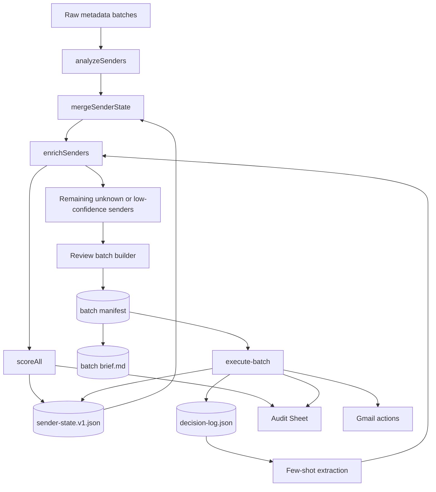
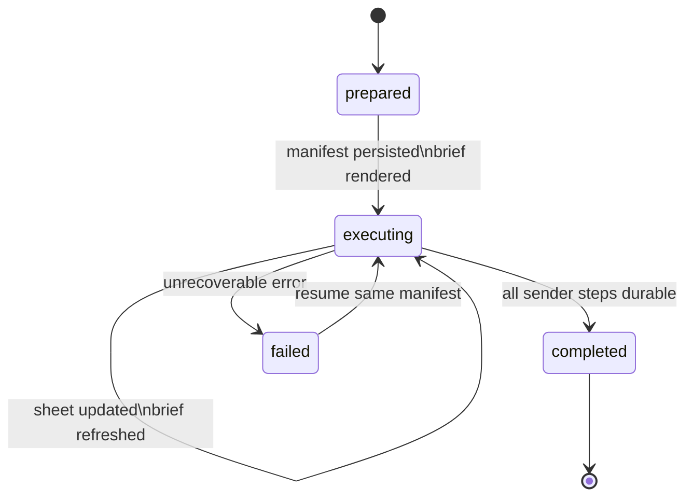
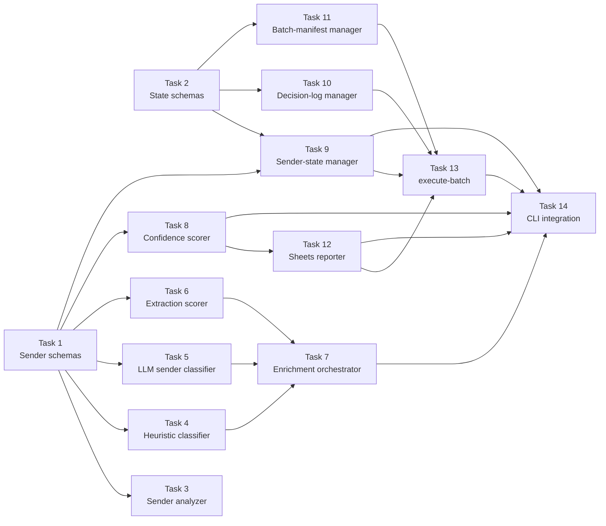
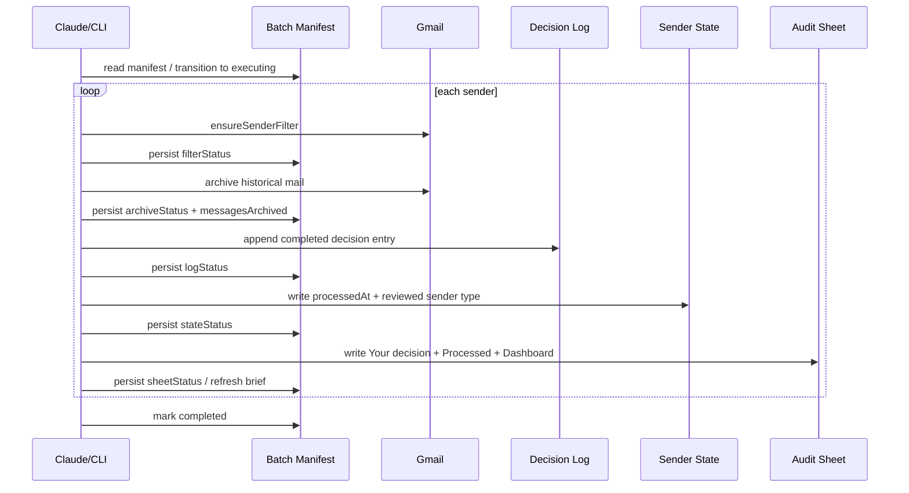

# Sender Enrichment & Conversational Review — Implementation Plan

> **For agentic workers:** REQUIRED: Use superpowers:subagent-driven-development (if subagents available) or superpowers:executing-plans to implement this plan. Steps use checkbox (`- [ ]`) syntax for tracking.

**Goal:** Add a sender enrichment pipeline (heuristic + LLM) and resumable batch execution to the inbox-zero CLI, so senders are classified by type and reviewed conversationally rather than via a 22k-row spreadsheet.

**Architecture:** Two-phase enrichment (deterministic heuristics → LLM for ambiguous senders) writes to a canonical `sender-state.v1.json`. User-reviewed sender types remain authoritative across later runs. Conversational review persists frozen batch manifests before executing Gmail actions. Missing local state is recoverable; corrupt local state is fatal. The audit sheet is a projection, not the source of truth.

**Tech Stack:** TypeScript (strict), Zod schemas, Vitest, googleapis (Gmail/Sheets), @anthropic-ai/sdk (Claude Haiku), Commander CLI.

**Spec:** `docs/specs/2026-03-18-sender-enrichment-design.md`

---

## Visual Model

### Artifact Flow



### Batch Execution State



## File Structure

### New Files

| File | Responsibility |
|------|---------------|
| `src/schemas/sender-type.ts` | `SenderTypeEnum`, `SenderType` type |
| `src/schemas/sender-state.ts` | `SenderStateFileSchema`, merge logic types |
| `src/schemas/decision-log.ts` | `DecisionEntrySchema`, `DecisionLogSchema` |
| `src/schemas/batch-manifest.ts` | `BatchManifestSchema`, sender entry schema |
| `src/enrichment/heuristic-classifier.ts` | Phase 1: deterministic sender type classification |
| `src/enrichment/llm-sender-classifier.ts` | Phase 2: Claude Haiku batch classification |
| `src/enrichment/extraction-scorer.ts` | Extraction candidate composite scoring |
| `src/enrichment/enrich-senders.ts` | Orchestrator: heuristics → LLM → extraction → merge |
| `src/state/sender-state-manager.ts` | Read/write/merge `data/sender-state.v1.json` |
| `src/state/decision-log-manager.ts` | Append/read `data/decision-log.json`, few-shot extraction |
| `src/state/batch-manifest-manager.ts` | Create/advance/complete manifests + render frozen batch briefs |
| `src/review/execute-batch.ts` | Resumable batch execution: filter → archive → log → state → sheet |
| `tests/schemas/sender-type.test.ts` | Schema validation tests |
| `tests/schemas/sender-state.test.ts` | Schema validation tests |
| `tests/schemas/decision-log.test.ts` | Schema validation tests |
| `tests/schemas/batch-manifest.test.ts` | Schema validation tests |
| `tests/enrichment/heuristic-classifier.test.ts` | Heuristic classification tests |
| `tests/enrichment/llm-sender-classifier.test.ts` | LLM classification tests |
| `tests/enrichment/extraction-scorer.test.ts` | Extraction scoring tests |
| `tests/enrichment/enrich-senders.test.ts` | Orchestrator integration tests |
| `tests/state/sender-state-manager.test.ts` | State read/write/merge tests |
| `tests/state/decision-log-manager.test.ts` | Decision log tests |
| `tests/state/batch-manifest-manager.test.ts` | Manifest lifecycle tests |
| `tests/review/execute-batch.test.ts` | Batch execution tests |

### Modified Files

| File | Changes |
|------|---------|
| `src/schemas/sender-stats.ts` | Add `senderType`, `senderTypeConfidence`, `extractionCandidate`, `starredCount`, `importantCount` optional fields |
| `src/analysis/sender-analyzer.ts` | Aggregate `starredCount` and `importantCount` from `labels` array |
| `src/analysis/confidence-scorer.ts` | Add `senderType` as 5th weighted signal, rebalance weights |
| `src/analysis/sheets-reporter.ts` | Add columns 14-16, create Dashboard tab |
| `src/cli.ts` | Add `enrich` and `execute-batch` commands, update `analyze` to integrate enrichment |
| `tests/analysis/sender-analyzer.test.ts` | Add tests for `starredCount`/`importantCount` |
| `tests/analysis/confidence-scorer.test.ts` | Add tests for `senderType` signal, updated weights |
| `tests/analysis/sheets-reporter.test.ts` | Add tests for new columns + Dashboard tab |

---

## Task Dependency Graph



**Parallelizable groups:**
- Tasks 1+2 (schema foundations — no dependencies between them)
- Tasks 3, 4, 5, 6, 8 (all depend only on Task 1)
- Tasks 9, 10, 11 (all depend only on Tasks 1+2)
- Task 7 (depends on 4, 5, 6)
- Task 12 (depends on 1, 8)
- Task 13 (depends on 9, 10, 11)
- Task 14 (depends on 7, 8, 9, 12, 13)

---

### Task 1: Schema Foundations — SenderType + SenderStats Updates

**Files:**
- Create: `src/schemas/sender-type.ts`
- Modify: `src/schemas/sender-stats.ts`
- Create: `tests/schemas/sender-type.test.ts`
- Modify: `tests/schemas/sender-stats.test.ts`

- [ ] **Step 1: Write failing tests for SenderTypeEnum**

```typescript
// tests/schemas/sender-type.test.ts
import { describe, expect, it } from "vitest";
import { SenderTypeEnum } from "../../src/schemas/sender-type.js";

describe("SenderTypeEnum", () => {
  it("accepts valid sender types", () => {
    for (const t of ["human", "company", "newsletter", "automated", "unknown"]) {
      expect(SenderTypeEnum.safeParse(t).success).toBe(true);
    }
  });

  it("rejects invalid sender types", () => {
    expect(SenderTypeEnum.safeParse("robot").success).toBe(false);
    expect(SenderTypeEnum.safeParse("").success).toBe(false);
    expect(SenderTypeEnum.safeParse(42).success).toBe(false);
  });
});
```

- [ ] **Step 2: Run test to verify it fails**

Run: `npx vitest run tests/schemas/sender-type.test.ts`
Expected: FAIL — module not found

- [ ] **Step 3: Implement SenderTypeEnum**

```typescript
// src/schemas/sender-type.ts
import { z } from "zod";

export const SenderTypeEnum = z.enum(["human", "company", "newsletter", "automated", "unknown"]);
export type SenderType = z.infer<typeof SenderTypeEnum>;

export const SenderTypeSourceEnum = z.enum(["heuristic", "llm", "user"]);
export type SenderTypeSource = z.infer<typeof SenderTypeSourceEnum>;
```

- [ ] **Step 4: Run test to verify it passes**

Run: `npx vitest run tests/schemas/sender-type.test.ts`
Expected: PASS

- [ ] **Step 5: Write failing tests for SenderStats new fields**

Add to `tests/schemas/sender-stats.test.ts`:

```typescript
describe("SenderStatsSchema — enrichment fields", () => {
  it("accepts stats without enrichment fields (backward-compatible)", () => {
    const base = { /* existing valid stats without new fields */ };
    expect(SenderStatsSchema.safeParse(base).success).toBe(true);
  });

  it("accepts stats with senderType and confidence", () => {
    const enriched = { ...base, senderType: "newsletter", senderTypeConfidence: 0.85 };
    const result = SenderStatsSchema.safeParse(enriched);
    expect(result.success).toBe(true);
  });

  it("accepts stats with extractionCandidate flag", () => {
    const enriched = { ...base, extractionCandidate: true };
    expect(SenderStatsSchema.safeParse(enriched).success).toBe(true);
  });

  it("accepts stats with starredCount and importantCount", () => {
    const enriched = { ...base, starredCount: 5, importantCount: 12 };
    expect(SenderStatsSchema.safeParse(enriched).success).toBe(true);
  });

  it("defaults starredCount and importantCount to 0", () => {
    const result = SenderStatsSchema.parse(base);
    expect(result.starredCount).toBe(0);
    expect(result.importantCount).toBe(0);
  });

  it("rejects invalid senderType", () => {
    const bad = { ...base, senderType: "robot" };
    expect(SenderStatsSchema.safeParse(bad).success).toBe(false);
  });

  it("rejects senderTypeConfidence outside 0-1", () => {
    expect(SenderStatsSchema.safeParse({ ...base, senderTypeConfidence: 1.5 }).success).toBe(false);
    expect(SenderStatsSchema.safeParse({ ...base, senderTypeConfidence: -0.1 }).success).toBe(false);
  });
});
```

- [ ] **Step 6: Run tests to verify new ones fail**

Run: `npx vitest run tests/schemas/sender-stats.test.ts`
Expected: New tests FAIL, existing tests PASS

- [ ] **Step 7: Add new fields to SenderStatsSchema**

Modify `src/schemas/sender-stats.ts` — add after existing fields:

```typescript
import { SenderTypeEnum } from "./sender-type.js";

// Add to SenderStatsSchema object:
senderType: SenderTypeEnum.optional(),
senderTypeConfidence: z.number().min(0).max(1).optional(),
extractionCandidate: z.boolean().optional(),
starredCount: z.number().int().min(0).default(0),
importantCount: z.number().int().min(0).default(0),
```

- [ ] **Step 8: Run all schema tests**

Run: `npx vitest run tests/schemas/`
Expected: ALL PASS

- [ ] **Step 9: Run full test suite for regressions**

Run: `npx vitest run`
Expected: ALL PASS (new fields are optional/defaulted, no breaking changes)

- [ ] **Step 10: Commit**

```bash
git add src/schemas/sender-type.ts src/schemas/sender-stats.ts tests/schemas/sender-type.test.ts tests/schemas/sender-stats.test.ts
git commit -m "feat(inbox-zero): add SenderTypeEnum and enrichment fields to SenderStatsSchema"
```

---

### Task 2: State Schemas — SenderState, DecisionLog, BatchManifest

**Files:**
- Create: `src/schemas/sender-state.ts`
- Create: `src/schemas/decision-log.ts`
- Create: `src/schemas/batch-manifest.ts`
- Create: `tests/schemas/sender-state.test.ts`
- Create: `tests/schemas/decision-log.test.ts`
- Create: `tests/schemas/batch-manifest.test.ts`

**Depends on:** Task 1 (SenderTypeEnum, SenderStatsSchema)

- [ ] **Step 1: Write failing tests for SenderStateFileSchema**

```typescript
// tests/schemas/sender-state.test.ts
import { describe, expect, it } from "vitest";
import { SenderStateFileSchema } from "../../src/schemas/sender-state.js";

describe("SenderStateFileSchema", () => {
  const validSender = {
    senderEmail: "test@example.com",
    senderName: "Test",
    emailCount: 10,
    firstEmailDate: "2025-01-01T00:00:00.000Z",
    lastEmailDate: "2026-03-01T00:00:00.000Z",
    gmailCategory: "primary",
    unreadRatio: 0.2,
    threadCount: 5,
    sampleSubjects: ["Hello"],
    surprisesFlag: false,
  };

  it("accepts a valid sender-state file", () => {
    const file = {
      version: 1,
      mailbox: "mailbox@example.com",
      generatedAt: "2026-03-18T12:00:00Z",
      senders: [validSender],
    };
    expect(SenderStateFileSchema.safeParse(file).success).toBe(true);
  });

  it("accepts senders with enrichment fields", () => {
    const file = {
      version: 1,
      mailbox: "mailbox@example.com",
      generatedAt: "2026-03-18T12:00:00Z",
      senders: [{
        ...validSender,
        senderType: "newsletter",
        senderTypeConfidence: 0.9,
        senderTypeSource: "heuristic",
        reviewedSenderType: "company",
        reviewedAt: "2026-03-18T14:00:00Z",
        processedAt: "2026-03-18T15:00:00Z",
      }],
    };
    expect(SenderStateFileSchema.safeParse(file).success).toBe(true);
  });

  it("rejects version !== 1", () => {
    const file = { version: 2, mailbox: "x", generatedAt: "2026-03-18T12:00:00Z", senders: [] };
    expect(SenderStateFileSchema.safeParse(file).success).toBe(false);
  });
});
```

- [ ] **Step 2: Implement SenderStateFileSchema**

```typescript
// src/schemas/sender-state.ts
import { z } from "zod";
import { SenderStatsSchema } from "./sender-stats.js";
import { SenderTypeEnum, SenderTypeSourceEnum } from "./sender-type.js";

export const SenderStateEntrySchema = SenderStatsSchema.extend({
  senderTypeSource: SenderTypeSourceEnum.optional(),
  reviewedSenderType: SenderTypeEnum.optional(),
  reviewedAt: z.string().datetime().optional(),
  processedAt: z.string().datetime().optional(),
});

export type SenderStateEntry = z.infer<typeof SenderStateEntrySchema>;

export const SenderStateFileSchema = z.object({
  version: z.literal(1),
  mailbox: z.string().min(1),
  generatedAt: z.string().datetime(),
  senders: z.array(SenderStateEntrySchema),
});

export type SenderStateFile = z.infer<typeof SenderStateFileSchema>;
```

- [ ] **Step 3: Run test to verify it passes**

Run: `npx vitest run tests/schemas/sender-state.test.ts`
Expected: PASS

- [ ] **Step 4: Write failing tests for DecisionLogSchema**

```typescript
// tests/schemas/decision-log.test.ts
import { describe, expect, it } from "vitest";
import { DecisionLogSchema, DecisionEntrySchema } from "../../src/schemas/decision-log.js";

describe("DecisionEntrySchema", () => {
  const validEntry = {
    runId: "run-001",
    senderEmail: "news@example.com",
    senderName: "Example News",
    presentedSenderType: "newsletter",
    senderTypeFeedback: "none",
    systemRecommendation: "unsubscribe",
    userDecision: "unsubscribe",
    batchId: "newsletter-batch-1",
    timestamp: "2026-03-18T14:30:00Z",
    emailCount: 2340,
    actionsTaken: ["filter_created", "archived_2340"],
  };

  it("accepts a valid entry", () => {
    expect(DecisionEntrySchema.safeParse(validEntry).success).toBe(true);
  });

  it("accepts entry with sender type correction", () => {
    const corrected = { ...validEntry, reviewedSenderType: "company", senderTypeFeedback: "corrected" };
    expect(DecisionEntrySchema.safeParse(corrected).success).toBe(true);
  });

  it("rejects invalid senderTypeFeedback", () => {
    expect(DecisionEntrySchema.safeParse({ ...validEntry, senderTypeFeedback: "maybe" }).success).toBe(false);
  });
});

describe("DecisionLogSchema", () => {
  it("accepts valid log with version 1", () => {
    const log = { version: 1, decisions: [] };
    expect(DecisionLogSchema.safeParse(log).success).toBe(true);
  });
});
```

- [ ] **Step 5: Implement DecisionLogSchema**

```typescript
// src/schemas/decision-log.ts
import { z } from "zod";
import { SenderTypeEnum } from "./sender-type.js";

export const SenderTypeFeedbackEnum = z.enum(["none", "confirmed", "corrected"]);

export const DecisionEntrySchema = z.object({
  runId: z.string().min(1),
  senderEmail: z.string().min(1),
  senderName: z.string(),
  presentedSenderType: SenderTypeEnum,
  reviewedSenderType: SenderTypeEnum.optional(),
  senderTypeFeedback: SenderTypeFeedbackEnum,
  systemRecommendation: z.enum(["keep", "filter", "unsubscribe"]),
  userDecision: z.enum(["keep", "filter", "unsubscribe"]),
  batchId: z.string().min(1),
  timestamp: z.string().datetime(),
  emailCount: z.number().int().min(0),
  actionsTaken: z.array(z.string()),
});

export type DecisionEntry = z.infer<typeof DecisionEntrySchema>;

export const DecisionLogSchema = z.object({
  version: z.literal(1),
  decisions: z.array(DecisionEntrySchema),
});

export type DecisionLog = z.infer<typeof DecisionLogSchema>;
```

- [ ] **Step 6: Run test to verify it passes**

Run: `npx vitest run tests/schemas/decision-log.test.ts`
Expected: PASS

- [ ] **Step 7: Write failing tests for BatchManifestSchema**

```typescript
// tests/schemas/batch-manifest.test.ts
import { describe, expect, it } from "vitest";
import { BatchManifestSchema } from "../../src/schemas/batch-manifest.js";

describe("BatchManifestSchema", () => {
  const validManifest = {
    version: 1,
    runId: "run-001",
    batchId: "newsletter-batch-1",
    batchType: "newsletter",
    groupingReason: "Highest-volume newsletter senders, sorted by email count descending",
    presentedRecommendation: "unsubscribe",
    summary: {
      senderCount: 1,
      totalEmailCount: 2340,
      averageUnreadRatio: 0.94,
    },
    status: "prepared",
    createdAt: "2026-03-18T14:00:00Z",
    senders: [{
      senderEmail: "news@example.com",
      senderName: "Example News",
      emailCount: 2340,
      unreadRatio: 0.94,
      lastEmailDate: "2026-03-10T00:00:00Z",
      presentedSenderType: "newsletter",
      systemRecommendation: "unsubscribe",
      userDecision: "unsubscribe",
      filterStatus: "pending",
      archiveStatus: "pending",
      logStatus: "pending",
      stateStatus: "pending",
      sheetStatus: "pending",
      messagesArchived: 0,
    }],
  };

  it("accepts a valid prepared manifest", () => {
    expect(BatchManifestSchema.safeParse(validManifest).success).toBe(true);
  });

  it("accepts manifest with reviewedSenderType", () => {
    const m = { ...validManifest, senders: [{ ...validManifest.senders[0], reviewedSenderType: "company" }] };
    expect(BatchManifestSchema.safeParse(m).success).toBe(true);
  });

  it("rejects invalid status", () => {
    expect(BatchManifestSchema.safeParse({ ...validManifest, status: "running" }).success).toBe(false);
  });

  for (const status of ["prepared", "executing", "completed", "failed"]) {
    it(`accepts status "${status}"`, () => {
      expect(BatchManifestSchema.safeParse({ ...validManifest, status }).success).toBe(true);
    });
  }
});
```

- [ ] **Step 8: Implement BatchManifestSchema**

```typescript
// src/schemas/batch-manifest.ts
import { z } from "zod";
import { SenderTypeEnum } from "./sender-type.js";

const StepStatus = z.enum(["pending", "done", "skipped"]);
const LogStepStatus = z.enum(["pending", "done"]);

export const BatchSenderEntrySchema = z.object({
  senderEmail: z.string().min(1),
  senderName: z.string(),
  emailCount: z.number().int().min(0),
  unreadRatio: z.number().min(0).max(1),
  lastEmailDate: z.string().datetime(),
  presentedSenderType: SenderTypeEnum,
  reviewedSenderType: SenderTypeEnum.optional(),
  systemRecommendation: z.enum(["keep", "filter", "unsubscribe"]),
  userDecision: z.enum(["keep", "filter", "unsubscribe"]),
  filterStatus: StepStatus,
  archiveStatus: StepStatus,
  logStatus: LogStepStatus,
  stateStatus: LogStepStatus,
  sheetStatus: LogStepStatus,
  messagesArchived: z.number().int().min(0),
  lastError: z.string().optional(),
});

export type BatchSenderEntry = z.infer<typeof BatchSenderEntrySchema>;

export const BatchManifestSchema = z.object({
  version: z.literal(1),
  runId: z.string().min(1),
  batchId: z.string().min(1),
  batchType: SenderTypeEnum,
  groupingReason: z.string().min(1),
  presentedRecommendation: z.enum(["keep", "filter", "unsubscribe"]),
  summary: z.object({
    senderCount: z.number().int().positive(),
    totalEmailCount: z.number().int().min(0),
    averageUnreadRatio: z.number().min(0).max(1),
  }),
  status: z.enum(["prepared", "executing", "completed", "failed"]),
  createdAt: z.string().datetime(),
  senders: z.array(BatchSenderEntrySchema),
});

export type BatchManifest = z.infer<typeof BatchManifestSchema>;
```

- [ ] **Step 9: Run all schema tests**

Run: `npx vitest run tests/schemas/`
Expected: ALL PASS

- [ ] **Step 10: Commit**

```bash
git add src/schemas/sender-state.ts src/schemas/decision-log.ts src/schemas/batch-manifest.ts tests/schemas/sender-state.test.ts tests/schemas/decision-log.test.ts tests/schemas/batch-manifest.test.ts
git commit -m "feat(inbox-zero): add SenderState, DecisionLog, and BatchManifest schemas"
```

---

### Task 3: Update Sender Analyzer — starredCount + importantCount

**Files:**
- Modify: `src/analysis/sender-analyzer.ts`
- Modify: `tests/analysis/sender-analyzer.test.ts`

**Depends on:** Task 1

- [ ] **Step 1: Write failing tests for new aggregation fields**

Add to `tests/analysis/sender-analyzer.test.ts`:

**Note:** The existing `makeEmail` in this test file requires `messageId`, `threadId`, `dateReceived`, and `isUnread` as mandatory fields. Include these in every call:

```typescript
describe("analyzeSenders — starredCount and importantCount", () => {
  it("counts STARRED labels per sender", () => {
    const base = { threadId: "t1", dateReceived: new Date("2026-01-01"), isUnread: false };
    const emails = [
      makeEmail({ ...base, messageId: "m1", senderEmail: "a@test.com", labels: ["STARRED", "INBOX"] }),
      makeEmail({ ...base, messageId: "m2", senderEmail: "a@test.com", labels: ["INBOX"] }),
      makeEmail({ ...base, messageId: "m3", senderEmail: "a@test.com", labels: ["STARRED"] }),
    ];
    const stats = analyzeSenders(emails);
    expect(stats).toHaveLength(1);
    expect(stats[0]!.starredCount).toBe(2);
  });

  it("counts IMPORTANT labels per sender", () => {
    const base = { threadId: "t1", dateReceived: new Date("2026-01-01"), isUnread: false };
    const emails = [
      makeEmail({ ...base, messageId: "m1", senderEmail: "a@test.com", labels: ["IMPORTANT"] }),
      makeEmail({ ...base, messageId: "m2", senderEmail: "a@test.com", labels: [] }),
    ];
    const stats = analyzeSenders(emails);
    expect(stats[0]!.importantCount).toBe(1);
  });

  it("defaults to 0 when no STARRED/IMPORTANT labels", () => {
    const emails = [makeEmail({
      messageId: "m1", threadId: "t1", senderEmail: "a@test.com",
      dateReceived: new Date("2026-01-01"), isUnread: false, labels: ["INBOX"],
    })];
    const stats = analyzeSenders(emails);
    expect(stats[0]!.starredCount).toBe(0);
    expect(stats[0]!.importantCount).toBe(0);
  });
});
```

- [ ] **Step 2: Run tests to verify they fail**

Run: `npx vitest run tests/analysis/sender-analyzer.test.ts`
Expected: New tests FAIL (starredCount/importantCount not yet aggregated)

- [ ] **Step 3: Update SenderAccumulator and accumulation logic**

In `src/analysis/sender-analyzer.ts`, add to `SenderAccumulator` interface:

```typescript
starredCount: number;
importantCount: number;
```

Initialize in accumulator creation:

```typescript
starredCount: 0,
importantCount: 0,
```

Add in the accumulation loop (after unread count):

```typescript
if (email.labels.includes("STARRED")) {
  acc.starredCount += 1;
}
if (email.labels.includes("IMPORTANT")) {
  acc.importantCount += 1;
}
```

Add to the stats.push() call in conversion phase:

```typescript
starredCount: acc.starredCount,
importantCount: acc.importantCount,
```

- [ ] **Step 4: Run all sender-analyzer tests**

Run: `npx vitest run tests/analysis/sender-analyzer.test.ts`
Expected: ALL PASS

- [ ] **Step 5: Run full test suite**

Run: `npx vitest run`
Expected: ALL PASS

- [ ] **Step 6: Commit**

```bash
git add src/analysis/sender-analyzer.ts tests/analysis/sender-analyzer.test.ts
git commit -m "feat(inbox-zero): aggregate starredCount and importantCount in sender analyzer"
```

---

### Task 4: Heuristic Classifier

**Files:**
- Create: `src/enrichment/heuristic-classifier.ts`
- Create: `tests/enrichment/heuristic-classifier.test.ts`

**Depends on:** Task 1

- [ ] **Step 1: Write failing tests**

Test the core classification function with known patterns. Key test cases:

```typescript
// tests/enrichment/heuristic-classifier.test.ts
import { describe, expect, it } from "vitest";
import { classifyHeuristic } from "../../src/enrichment/heuristic-classifier.js";
import type { SenderStats } from "../../src/schemas/sender-stats.js";

function makeSender(overrides: Partial<SenderStats> = {}): SenderStats {
  return {
    senderEmail: "test@example.com",
    senderName: "Test User",
    emailCount: 10,
    firstEmailDate: "2025-01-01T00:00:00Z",
    lastEmailDate: "2026-03-01T00:00:00Z",
    gmailCategory: "primary",
    unreadRatio: 0.2,
    threadCount: 8,
    sampleSubjects: ["Hello", "Re: Meeting"],
    surprisesFlag: false,
    starredCount: 0,
    importantCount: 0,
    ...overrides,
  };
}

describe("classifyHeuristic", () => {
  describe("hard overrides — automated local parts", () => {
    for (const local of ["noreply", "no-reply", "notifications", "mailer", "digest"]) {
      it(`${local}@domain → automated (hard override)`, () => {
        const result = classifyHeuristic(makeSender({ senderEmail: `${local}@company.com` }));
        expect(result.senderType).toBe("automated");
      });
    }

    it("noreply@gmail.com → automated (not human despite freemail domain)", () => {
      const result = classifyHeuristic(makeSender({ senderEmail: "noreply@gmail.com" }));
      expect(result.senderType).toBe("automated");
    });
  });

  describe("freemail domains → human", () => {
    for (const domain of ["gmail.com", "yahoo.com", "hotmail.com", "outlook.com", "icloud.com"]) {
      it(`user@${domain} → human`, () => {
        const result = classifyHeuristic(makeSender({
          senderEmail: `jane@${domain}`,
          senderName: "Jane Smith",
          threadCount: 8,
          emailCount: 10,
        }));
        expect(result.senderType).toBe("human");
      });
    }
  });

  describe("display name patterns", () => {
    it("'Firstname Lastname' pattern → human signal", () => {
      const result = classifyHeuristic(makeSender({
        senderEmail: "jane@acme.com",
        senderName: "Jane Smith",
        threadCount: 8,
        sampleSubjects: ["Re: Q4 planning", "Meeting notes"],
      }));
      expect(result.senderType).toBe("human");
    });

    it("name with 'Newsletter' → newsletter signal", () => {
      const result = classifyHeuristic(makeSender({
        senderEmail: "hello@techco.com",
        senderName: "TechCo Newsletter",
        threadCount: 1,
        emailCount: 50,
        unreadRatio: 0.9,
      }));
      expect(result.senderType).toBe("newsletter");
    });
  });

  describe("thread ratio", () => {
    it("high thread ratio (≥0.7) → human signal", () => {
      const result = classifyHeuristic(makeSender({
        senderEmail: "bob@acme.com",
        senderName: "Bob Jones",
        threadCount: 9,
        emailCount: 10,
        sampleSubjects: ["Re: Project update"],
      }));
      expect(result.senderType).toBe("human");
    });

    it("low thread ratio (≤0.1) → newsletter/automated signal", () => {
      const result = classifyHeuristic(makeSender({
        senderEmail: "updates@service.com",
        senderName: "Service Updates",
        threadCount: 2,
        emailCount: 100,
        sampleSubjects: ["Your weekly digest", "Your monthly report"],
      }));
      expect(["newsletter", "automated"]).toContain(result.senderType);
    });
  });

  describe("subject pattern detection", () => {
    it("template subjects → automated", () => {
      const result = classifyHeuristic(makeSender({
        senderEmail: "orders@shop.com",
        senderName: "Shop",
        threadCount: 1,
        emailCount: 20,
        sampleSubjects: ["Your order #12345", "Your receipt", "Shipping update for order #12346"],
      }));
      expect(["automated", "newsletter"]).toContain(result.senderType);
    });
  });

  describe("ambiguous senders → unknown", () => {
    it("returns unknown when no signal reaches threshold", () => {
      const result = classifyHeuristic(makeSender({
        senderEmail: "contact@ambiguous.io",
        senderName: "Ambiguous",
        threadCount: 3,
        emailCount: 5,
        sampleSubjects: ["Info"],
      }));
      expect(result.senderType).toBe("unknown");
    });
  });

  it("returns confidence score between 0 and 1", () => {
    const result = classifyHeuristic(makeSender({ senderEmail: "jane@gmail.com" }));
    expect(result.confidence).toBeGreaterThanOrEqual(0);
    expect(result.confidence).toBeLessThanOrEqual(1);
  });
});
```

- [ ] **Step 2: Run tests to verify they fail**

Run: `npx vitest run tests/enrichment/heuristic-classifier.test.ts`
Expected: FAIL — module not found

- [ ] **Step 3: Implement heuristic classifier**

```typescript
// src/enrichment/heuristic-classifier.ts
import type { SenderStats } from "../schemas/sender-stats.js";
import type { SenderType } from "../schemas/sender-type.js";
import { emailDomain } from "../utils.js";

export interface HeuristicResult {
  senderType: SenderType;
  confidence: number;
}

// --- Hard override local parts (always automated) ---
const AUTOMATED_LOCAL_PARTS = new Set([
  "noreply", "no-reply", "notifications", "mailer", "digest",
]);

// --- Freemail domains (strong human signal) ---
const FREEMAIL_DOMAINS = new Set([
  "gmail.com", "yahoo.com", "hotmail.com", "outlook.com", "icloud.com",
  "aol.com", "protonmail.com", "proton.me", "mail.com", "zoho.com",
  "yandex.com", "gmx.com", "fastmail.com", "tutanota.com", "hey.com",
  "live.com", "msn.com", "me.com", "mac.com", "yahoo.co.uk",
]);

// --- Automated local parts (soft — not hard overrides) ---
const SOFT_AUTOMATED_LOCAL_PARTS = new Set([
  "support", "billing", "info", "team", "hello", "updates",
  "news", "marketing", "contact", "admin", "sales",
]);

// --- Display name corporate keywords ---
const CORPORATE_KEYWORDS = /\b(team|inc|llc|corp|newsletter|updates|digest|news|weekly|daily|monthly)\b/iu;

// --- Subject template patterns ---
const TEMPLATE_SUBJECT_PATTERNS = [
  /your\s+(order|receipt|invoice|statement|subscription|account)/iu,
  /order\s*#/iu,
  /shipping\s+(update|confirmation|notification)/iu,
  /(weekly|daily|monthly)\s+(digest|report|summary|update|roundup)/iu,
];

// --- Conversational subject patterns ---
const CONVERSATIONAL_PATTERNS = [
  /^Re:\s/u,
  /^Fwd:\s/u,
];

// --- Human name pattern: 2-3 capitalized words, no special chars ---
const HUMAN_NAME_PATTERN = /^[A-Z][a-z]{1,20}(\s[A-Z][a-z]{1,20}){1,2}$/u;

export function classifyHeuristic(sender: SenderStats): HeuristicResult {
  const localPart = sender.senderEmail.split("@")[0]?.toLowerCase() ?? "";
  const domain = emailDomain(sender.senderEmail).toLowerCase();

  // --- Hard override: automated local parts ---
  if (AUTOMATED_LOCAL_PARTS.has(localPart)) {
    return { senderType: "automated", confidence: 0.95 };
  }

  // --- Weighted voting ---
  const scores: Record<string, number> = { human: 0, company: 0, newsletter: 0, automated: 0 };

  // Signal 1: Freemail domain
  if (FREEMAIL_DOMAINS.has(domain)) {
    scores["human"] += 0.7;
  }

  // Signal 2: Soft automated local parts
  if (SOFT_AUTOMATED_LOCAL_PARTS.has(localPart)) {
    scores["automated"] += 0.8;
  }

  // Signal 3: Display name analysis
  const name = sender.senderName.trim();
  if (name.length > 0) {
    if (HUMAN_NAME_PATTERN.test(name)) {
      scores["human"] += 0.4;
    }
    if (CORPORATE_KEYWORDS.test(name)) {
      if (/newsletter/iu.test(name)) {
        scores["newsletter"] += 0.5;
      } else {
        scores["company"] += 0.5;
      }
    }
    if (name === "" || name.toLowerCase() === localPart) {
      scores["automated"] += 0.3;
    }
  } else {
    scores["automated"] += 0.3;
  }

  // Signal 4: Thread ratio
  if (sender.emailCount > 0) {
    const threadRatio = sender.threadCount / sender.emailCount;
    if (threadRatio >= 0.7) {
      scores["human"] += 0.3;
    } else if (threadRatio <= 0.1) {
      scores["newsletter"] += 0.2;
      scores["automated"] += 0.2;
    }
  }

  // Signal 5: Subject pattern detection
  const subjects = sender.sampleSubjects;
  const templateMatches = subjects.filter((s) =>
    TEMPLATE_SUBJECT_PATTERNS.some((p) => p.test(s)),
  ).length;
  const conversationalMatches = subjects.filter((s) =>
    CONVERSATIONAL_PATTERNS.some((p) => p.test(s)),
  ).length;

  if (templateMatches > 0 && subjects.length > 0) {
    scores["automated"] += 0.5 * (templateMatches / subjects.length);
  }
  if (conversationalMatches > 0 && subjects.length > 0) {
    scores["human"] += 0.3 * (conversationalMatches / subjects.length);
  }

  // --- Find winner ---
  let bestType: SenderType = "unknown";
  let bestScore = 0;
  for (const [type, score] of Object.entries(scores)) {
    if (score > bestScore) {
      bestScore = score;
      bestType = type as SenderType;
    } else if (score === bestScore && score > 0 && type !== "human") {
      // Tie-break: prefer non-human (cautious approach)
      bestType = type as SenderType;
    }
  }

  if (bestScore < 0.6) {
    return { senderType: "unknown", confidence: bestScore };
  }

  // Normalize confidence to 0-1 range (cap at 1.0)
  const confidence = Math.min(bestScore, 1.0);
  return { senderType: bestType, confidence };
}
```

- [ ] **Step 4: Run tests**

Run: `npx vitest run tests/enrichment/heuristic-classifier.test.ts`
Expected: ALL PASS

- [ ] **Step 5: Run lint**

Run: `npx biome check src/enrichment/heuristic-classifier.ts`
Expected: No errors

- [ ] **Step 6: Commit**

```bash
git add src/enrichment/heuristic-classifier.ts tests/enrichment/heuristic-classifier.test.ts
git commit -m "feat(inbox-zero): add heuristic sender type classifier (Phase 1)"
```

---

### Task 5: LLM Sender Classifier

**Files:**
- Create: `src/enrichment/llm-sender-classifier.ts`
- Create: `tests/enrichment/llm-sender-classifier.test.ts`

**Depends on:** Task 1

- [ ] **Step 1: Write failing tests**

Key test cases: batching, prompt construction, response parsing, error handling, few-shot context injection.

```typescript
// tests/enrichment/llm-sender-classifier.test.ts
import { describe, expect, it, vi } from "vitest";
import {
  classifySendersWithLlm,
  buildClassificationPrompt,
  parseClassificationResponse,
} from "../../src/enrichment/llm-sender-classifier.js";
import type { SenderStats } from "../../src/schemas/sender-stats.js";

function makeSender(overrides: Partial<SenderStats> = {}): SenderStats { /* same as Task 4 */ }

describe("buildClassificationPrompt", () => {
  it("includes sender metadata in user message", () => {
    const senders = [makeSender({ senderEmail: "hello@acme.com", senderName: "Acme" })];
    const prompt = buildClassificationPrompt(senders, []);
    expect(prompt.userMessage).toContain("hello@acme.com");
    expect(prompt.userMessage).toContain("Acme");
  });

  it("includes few-shot examples when provided", () => {
    const examples = [{ email: "news@co.com", senderType: "newsletter" as const, context: "..." }];
    const prompt = buildClassificationPrompt([makeSender()], examples);
    expect(prompt.systemMessage).toContain("news@co.com");
    expect(prompt.systemMessage).toContain("newsletter");
  });

  it("batches at most 50 senders per prompt", () => {
    const senders = Array.from({ length: 60 }, (_, i) =>
      makeSender({ senderEmail: `s${i}@test.com` }),
    );
    const prompt = buildClassificationPrompt(senders.slice(0, 50), []);
    const parsed = JSON.parse(prompt.userMessage.slice(prompt.userMessage.indexOf("[")));
    expect(parsed).toHaveLength(50);
  });
});

describe("parseClassificationResponse", () => {
  it("parses valid JSON array response", () => {
    const json = JSON.stringify([
      { email: "a@test.com", senderType: "human", confidence: 0.9 },
      { email: "b@test.com", senderType: "newsletter", confidence: 0.85 },
    ]);
    const results = parseClassificationResponse(json);
    expect(results).toHaveLength(2);
    expect(results[0]!.senderType).toBe("human");
  });

  it("skips malformed entries without failing", () => {
    const json = JSON.stringify([
      { email: "a@test.com", senderType: "human", confidence: 0.9 },
      { email: "b@test.com", senderType: "invalid_type" },
      { email: "c@test.com" },
    ]);
    const results = parseClassificationResponse(json);
    expect(results).toHaveLength(1);
  });

  it("returns empty array on unparseable response", () => {
    const results = parseClassificationResponse("not json at all");
    expect(results).toHaveLength(0);
  });
});
```

- [ ] **Step 2: Run tests to verify they fail**

Run: `npx vitest run tests/enrichment/llm-sender-classifier.test.ts`
Expected: FAIL

- [ ] **Step 3: Implement LLM sender classifier**

```typescript
// src/enrichment/llm-sender-classifier.ts
import Anthropic from "@anthropic-ai/sdk";
import type { SenderStats } from "../schemas/sender-stats.js";
import type { SenderType } from "../schemas/sender-type.js";
import { SenderTypeEnum } from "../schemas/sender-type.js";
import { chunkArray } from "../utils.js";
import { z } from "zod";

const BATCH_SIZE = 50;
const MODEL = "claude-haiku-4-5-20251001";

export interface FewShotExample {
  email: string;
  senderType: SenderType;
  context: string;
}

export interface ClassificationResult {
  senderType: SenderType;
  confidence: number;
}

// --- Zod schema for parsing LLM response entries ---
const LlmEntrySchema = z.object({
  email: z.string(),
  senderType: SenderTypeEnum,
  confidence: z.number().min(0).max(1),
});

// --- Prompt construction ---

export function buildClassificationPrompt(
  senders: SenderStats[],
  fewShotExamples: FewShotExample[],
): { systemMessage: string; userMessage: string } {
  let systemMessage = `You classify email senders into exactly one of: human, company, newsletter, automated.
Return a JSON array. Each element: {"email": "...", "senderType": "...", "confidence": 0.0-1.0}.
Only output the JSON array, no other text.`;

  if (fewShotExamples.length > 0) {
    systemMessage += "\n\nExamples of previously classified senders:\n";
    for (const ex of fewShotExamples) {
      systemMessage += `- ${ex.email} → ${ex.senderType} (${ex.context})\n`;
    }
  }

  const senderData = senders.map((s) => ({
    email: s.senderEmail,
    name: s.senderName,
    domain: s.senderEmail.split("@")[1] ?? "",
    subjects: s.sampleSubjects.slice(0, 5),
    emailCount: s.emailCount,
    gmailCategory: s.gmailCategory,
    unreadRatio: Math.round(s.unreadRatio * 100) / 100,
    threadCount: s.threadCount,
  }));

  const userMessage = `Classify these senders:\n${JSON.stringify(senderData, null, 2)}`;

  return { systemMessage, userMessage };
}

// --- Response parsing ---

export function parseClassificationResponse(text: string): Array<{ email: string } & ClassificationResult> {
  // Extract JSON array from response (may have surrounding text)
  const jsonMatch = text.match(/\[[\s\S]*\]/u);
  if (!jsonMatch) return [];

  let parsed: unknown;
  try {
    parsed = JSON.parse(jsonMatch[0]);
  } catch {
    return [];
  }

  if (!Array.isArray(parsed)) return [];

  const results: Array<{ email: string } & ClassificationResult> = [];
  for (const item of parsed) {
    const validated = LlmEntrySchema.safeParse(item);
    if (validated.success) {
      results.push({
        email: validated.data.email,
        senderType: validated.data.senderType,
        confidence: validated.data.confidence,
      });
    }
  }
  return results;
}

// --- Orchestrator ---

export async function classifySendersWithLlm(
  senders: SenderStats[],
  client: Anthropic,
  fewShotExamples: FewShotExample[],
  onProgress?: (info: { batch: number; total: number }) => void,
): Promise<Map<string, ClassificationResult>> {
  const results = new Map<string, ClassificationResult>();
  const batches = chunkArray(senders, BATCH_SIZE);

  for (let i = 0; i < batches.length; i++) {
    const batch = batches[i]!;
    const { systemMessage, userMessage } = buildClassificationPrompt(batch, fewShotExamples);

    let responseText = "";
    let retries = 0;

    while (retries < 2) {
      try {
        const response = await client.messages.create({
          model: MODEL,
          max_tokens: 4096,
          system: systemMessage,
          messages: [{ role: "user", content: userMessage }],
        });

        const textBlock = response.content.find((b) => b.type === "text");
        responseText = textBlock?.text ?? "";

        const parsed = parseClassificationResponse(responseText);
        if (parsed.length > 0) {
          for (const entry of parsed) {
            results.set(entry.email, { senderType: entry.senderType, confidence: entry.confidence });
          }
          break;
        }
        retries++;
      } catch {
        retries++;
      }
    }

    // Mark any senders not in results as unknown
    for (const sender of batch) {
      if (!results.has(sender.senderEmail)) {
        results.set(sender.senderEmail, { senderType: "unknown", confidence: 0 });
      }
    }

    onProgress?.({ batch: i + 1, total: batches.length });
  }

  return results;
}

// --- Factory for LlmSenderProvider interface ---

import type { LlmSenderProvider } from "./enrich-senders.js";

export function createLlmSenderProvider(apiKey: string): LlmSenderProvider {
  const client = new Anthropic({ apiKey });

  return {
    async classifySenders(
      senders: SenderStats[],
      fewShotExamples: FewShotExample[],
    ): Promise<Map<string, ClassificationResult>> {
      return classifySendersWithLlm(senders, client, fewShotExamples);
    },
  };
}
```

**Note:** This creates a circular import between `enrich-senders.ts` (defines `LlmSenderProvider` interface) and `llm-sender-classifier.ts` (imports it). To resolve: move the `LlmSenderProvider` interface to a shared types file, or have `llm-sender-classifier.ts` define its own compatible interface and let `enrich-senders.ts` import it. The implementer should choose the cleanest approach — preferably defining the interface in `llm-sender-classifier.ts` and importing it in `enrich-senders.ts`.

- [ ] **Step 4: Run tests**

Run: `npx vitest run tests/enrichment/llm-sender-classifier.test.ts`
Expected: ALL PASS

- [ ] **Step 5: Commit**

```bash
git add src/enrichment/llm-sender-classifier.ts tests/enrichment/llm-sender-classifier.test.ts
git commit -m "feat(inbox-zero): add LLM sender type classifier (Phase 2)"
```

---

### Task 6: Extraction Candidate Scorer

**Files:**
- Create: `src/enrichment/extraction-scorer.ts`
- Create: `tests/enrichment/extraction-scorer.test.ts`

**Depends on:** Task 1

- [ ] **Step 1: Write failing tests**

```typescript
// tests/enrichment/extraction-scorer.test.ts
import { describe, expect, it } from "vitest";
import { scoreExtraction } from "../../src/enrichment/extraction-scorer.js";
import type { SenderStats } from "../../src/schemas/sender-stats.js";

function makeSender(overrides: Partial<SenderStats> = {}): SenderStats { /* defaults */ }

describe("scoreExtraction", () => {
  it("high-engagement human sender → extractionCandidate = true", () => {
    const result = scoreExtraction(makeSender({
      senderType: "human",
      gmailCategory: "primary",
      threadCount: 8,
      emailCount: 10,
      unreadRatio: 0.1,
      starredCount: 3,
      importantCount: 5,
    }));
    expect(result).toBe(true);
  });

  it("unread newsletter → extractionCandidate = false", () => {
    const result = scoreExtraction(makeSender({
      senderType: "newsletter",
      gmailCategory: "promotions",
      threadCount: 1,
      emailCount: 100,
      unreadRatio: 0.95,
      starredCount: 0,
      importantCount: 0,
    }));
    expect(result).toBe(false);
  });

  it("sender with no type yet → uses other signals only", () => {
    const result = scoreExtraction(makeSender({
      gmailCategory: "primary",
      threadCount: 5,
      emailCount: 6,
      unreadRatio: 0.0,
      starredCount: 2,
      importantCount: 3,
    }));
    // Should still score based on available signals
    expect(typeof result).toBe("boolean");
  });

  it("single-email sender → not extraction candidate", () => {
    const result = scoreExtraction(makeSender({
      senderType: "human",
      emailCount: 1,
      threadCount: 1,
    }));
    expect(result).toBe(false);
  });
});
```

- [ ] **Step 2: Implement extraction scorer**

```typescript
// src/enrichment/extraction-scorer.ts
import type { SenderStats } from "../schemas/sender-stats.js";

const REPLY_WEIGHT = 0.40;
const READ_WEIGHT = 0.30;
const EXPLICIT_WEIGHT = 0.20;
const CONTENT_WEIGHT = 0.10;
const THRESHOLD = 0.5;

export function scoreExtraction(sender: SenderStats): boolean {
  if (sender.emailCount < 3) return false;

  // Reply/conversation proxy: threadCount / emailCount
  const threadRatio = sender.emailCount > 0 ? sender.threadCount / sender.emailCount : 0;
  const replyScore = Math.min(threadRatio / 0.5, 1.0); // normalize: 0.5+ ratio = max score

  // Read behavior: 1 - unreadRatio
  const readScore = 1 - sender.unreadRatio;

  // Explicit signals: (starredCount + importantCount) / emailCount
  const explicitRatio = (sender.starredCount + sender.importantCount) / sender.emailCount;
  const explicitScore = Math.min(explicitRatio / 0.1, 1.0); // normalize: 10%+ = max score

  // Content features
  let contentScore = 0;
  if (sender.senderType === "human") contentScore += 0.5;
  if (sender.gmailCategory === "primary") contentScore += 0.3;
  if (sender.emailCount >= 3) contentScore += 0.2;

  const composite =
    REPLY_WEIGHT * replyScore +
    READ_WEIGHT * readScore +
    EXPLICIT_WEIGHT * explicitScore +
    CONTENT_WEIGHT * contentScore;

  return composite >= THRESHOLD;
}
```

- [ ] **Step 3: Run tests**

Run: `npx vitest run tests/enrichment/extraction-scorer.test.ts`
Expected: ALL PASS

- [ ] **Step 4: Commit**

```bash
git add src/enrichment/extraction-scorer.ts tests/enrichment/extraction-scorer.test.ts
git commit -m "feat(inbox-zero): add extraction candidate scorer for Phase 2 flagging"
```

---

### Task 7: Enrichment Orchestrator

**Files:**
- Create: `src/enrichment/enrich-senders.ts`
- Create: `tests/enrichment/enrich-senders.test.ts`

**Depends on:** Tasks 4, 5, 6

- [ ] **Step 1: Write failing tests**

Test the orchestrator that runs heuristics → LLM → extraction scoring and merges results into SenderStats.

```typescript
// tests/enrichment/enrich-senders.test.ts
import { describe, expect, it, vi } from "vitest";
import { enrichSenders } from "../../src/enrichment/enrich-senders.js";
import type { SenderStats } from "../../src/schemas/sender-stats.js";
import type { SenderTypeSource } from "../../src/schemas/sender-type.js";

type EnrichableSender = SenderStats & {
  senderTypeSource?: SenderTypeSource;
  reviewedSenderType?: "human" | "company" | "newsletter" | "automated" | "unknown";
  reviewedAt?: string;
};

function makeSender(overrides: Partial<EnrichableSender> = {}): EnrichableSender { /* defaults */ }

describe("enrichSenders", () => {
  it("preserves user-reviewed sender types and skips reclassification", async () => {
    const mockProvider = { classifySenders: vi.fn() };
    const senders = [makeSender({
      senderEmail: "ceo@corp.io",
      senderType: "company",
      senderTypeSource: "user",
      reviewedSenderType: "company",
    })];
    const result = await enrichSenders(senders, { llmProvider: mockProvider, fewShotExamples: [] });
    expect(result[0]!.senderType).toBe("company");
    expect(result[0]!.senderTypeSource).toBe("user");
    expect(mockProvider.classifySenders).not.toHaveBeenCalled();
  });

  it("classifies freemail senders as human without LLM", async () => {
    const senders = [makeSender({ senderEmail: "jane@gmail.com", senderName: "Jane Smith" })];
    const result = await enrichSenders(senders, { llmProvider: undefined, fewShotExamples: [] });
    expect(result[0]!.senderType).toBe("human");
    expect(result[0]!.senderTypeConfidence).toBeGreaterThan(0);
  });

  it("sends ambiguous senders to LLM when provider is given", async () => {
    const mockProvider = { classifySenders: vi.fn().mockResolvedValue(new Map([
      ["mystery@corp.io", { senderType: "company" as const, confidence: 0.8 }],
    ])) };
    const senders = [makeSender({
      senderEmail: "mystery@corp.io",
      senderName: "Mystery",
      threadCount: 3,
      emailCount: 5,
    })];
    const result = await enrichSenders(senders, { llmProvider: mockProvider, fewShotExamples: [] });
    expect(result[0]!.senderType).toBe("company");
    expect(mockProvider.classifySenders).toHaveBeenCalledTimes(1);
  });

  it("populates extractionCandidate flag", async () => {
    const senders = [makeSender({
      senderEmail: "mentor@gmail.com",
      senderName: "My Mentor",
      senderType: "human",
      gmailCategory: "primary",
      threadCount: 8,
      emailCount: 10,
      unreadRatio: 0.1,
      starredCount: 5,
      importantCount: 3,
    })];
    const result = await enrichSenders(senders, { llmProvider: undefined, fewShotExamples: [] });
    expect(result[0]!.extractionCandidate).toBe(true);
  });

  it("does not mutate input array", async () => {
    const senders = [makeSender({ senderEmail: "jane@gmail.com" })];
    const original = { ...senders[0] };
    await enrichSenders(senders, { llmProvider: undefined, fewShotExamples: [] });
    expect(senders[0]).toEqual(original);
  });
});
```

- [ ] **Step 2: Implement enrichment orchestrator**

```typescript
// src/enrichment/enrich-senders.ts
import type { SenderStats } from "../schemas/sender-stats.js";
import type { SenderType, SenderTypeSource } from "../schemas/sender-type.js";
import { classifyHeuristic } from "./heuristic-classifier.js";
import { scoreExtraction } from "./extraction-scorer.js";

export type EnrichableSender = SenderStats & {
  senderTypeSource?: SenderTypeSource;
  reviewedSenderType?: SenderType;
  reviewedAt?: string;
};

export interface LlmSenderProvider {
  classifySenders(
    senders: SenderStats[],
    fewShotExamples: Array<{ email: string; senderType: SenderType; context: string }>,
  ): Promise<Map<string, { senderType: SenderType; confidence: number }>>;
}

export interface EnrichOptions {
  llmProvider: LlmSenderProvider | undefined;
  fewShotExamples: Array<{ email: string; senderType: SenderType; context: string }>;
  onProgress?: (info: { phase: string; processed: number; total: number }) => void;
}

export async function enrichSenders(
  senders: EnrichableSender[],
  options: EnrichOptions,
): Promise<EnrichableSender[]> {
  const enriched: EnrichableSender[] = [];
  const ambiguous: EnrichableSender[] = [];

  // Phase 0: preserve user-reviewed sender types verbatim
  for (const sender of senders) {
    if (sender.senderTypeSource === "user" || sender.reviewedSenderType !== undefined) {
      enriched.push({
        ...sender,
        senderType: sender.reviewedSenderType ?? sender.senderType ?? "unknown",
        senderTypeSource: "user",
      });
      continue;
    }

    // Phase 1: Heuristic classification
    const result = classifyHeuristic(sender);
    if (result.senderType !== "unknown") {
      enriched.push({
        ...sender,
        senderType: result.senderType,
        senderTypeConfidence: result.confidence,
        senderTypeSource: "heuristic",
      });
    } else {
      ambiguous.push(sender);
    }
  }

  options.onProgress?.({ phase: "heuristic", processed: enriched.length, total: senders.length });

  // Phase 2: LLM classification for ambiguous senders
  if (options.llmProvider && ambiguous.length > 0) {
    const llmResults = await options.llmProvider.classifySenders(ambiguous, options.fewShotExamples);
    for (const sender of ambiguous) {
      const llmResult = llmResults.get(sender.senderEmail);
      if (llmResult) {
        enriched.push({
          ...sender,
          senderType: llmResult.senderType,
          senderTypeConfidence: llmResult.confidence,
          senderTypeSource: "llm",
        });
      } else {
        enriched.push({ ...sender, senderType: "unknown", senderTypeConfidence: 0 });
      }
    }
  } else {
    for (const sender of ambiguous) {
      enriched.push({ ...sender, senderType: "unknown", senderTypeConfidence: 0 });
    }
  }

  options.onProgress?.({ phase: "llm", processed: enriched.length, total: senders.length });

  // Phase 3: Extraction candidate scoring
  return enriched.map((sender) => ({
    ...sender,
    extractionCandidate: scoreExtraction(sender),
  }));
}
```

- [ ] **Step 3: Run tests**

Run: `npx vitest run tests/enrichment/enrich-senders.test.ts`
Expected: ALL PASS

- [ ] **Step 4: Commit**

```bash
git add src/enrichment/enrich-senders.ts tests/enrichment/enrich-senders.test.ts
git commit -m "feat(inbox-zero): add enrichment orchestrator (heuristic + LLM + extraction)"
```

---

### Task 8: Update Confidence Scorer — senderType as 5th Signal

**Files:**
- Modify: `src/analysis/confidence-scorer.ts`
- Modify: `tests/analysis/confidence-scorer.test.ts`

**Depends on:** Task 1

- [ ] **Step 1: Write failing tests for senderType signal**

Add to `tests/analysis/confidence-scorer.test.ts`:

```typescript
describe("scoreConfidence — senderType signal", () => {
  it("human senderType boosts toward keep", () => {
    const base = makeSender({ senderType: "human", unreadRatio: 0.5, gmailCategory: "primary" });
    const result = scoreConfidence(base);
    expect(result.confidenceTier).toBe("definitely_keep");
  });

  it("newsletter senderType pushes toward noise", () => {
    const base = makeSender({ senderType: "newsletter", unreadRatio: 0.5, gmailCategory: "updates" });
    const result = scoreConfidence(base);
    expect(["probably_noise", "definitely_noise"]).toContain(result.confidenceTier);
  });

  it("automated senderType is strongest noise signal", () => {
    const base = makeSender({ senderType: "automated", unreadRatio: 0.3, gmailCategory: "primary" });
    const result = scoreConfidence(base);
    expect(["probably_noise", "definitely_noise"]).toContain(result.confidenceTier);
  });

  it("unknown senderType is neutral (0.5)", () => {
    const withUnknown = makeSender({ senderType: "unknown", unreadRatio: 0.5 });
    const without = makeSender({ unreadRatio: 0.5 });
    // unknown should behave similarly to no senderType
    const r1 = scoreConfidence(withUnknown);
    const r2 = scoreConfidence(without);
    expect(r1.confidenceTier).toBe(r2.confidenceTier);
  });
});

describe("scoreConfidence — weight rebalancing", () => {
  it("hard overrides still work unchanged", () => {
    const noreply = makeSender({ senderEmail: "noreply@company.com" });
    const result = scoreConfidence(noreply);
    expect(result.confidenceTier).toBe("definitely_noise");
    expect(result.recommendedAction).toBe("unsubscribe");
  });

  it("emailCount <= 1 still returns probably_keep", () => {
    const single = makeSender({ emailCount: 1 });
    const result = scoreConfidence(single);
    expect(result.confidenceTier).toBe("probably_keep");
  });
});
```

- [ ] **Step 2: Run tests to verify new ones fail**

Run: `npx vitest run tests/analysis/confidence-scorer.test.ts`
Expected: New senderType tests FAIL (senderType not yet used in scoring)

- [ ] **Step 3: Update confidence scorer**

In `src/analysis/confidence-scorer.ts`:

1. Update weight constants:
```typescript
const UNREAD_WEIGHT = 0.30;   // was 0.40
const CATEGORY_WEIGHT = 0.20; // was 0.25
const RECENCY_WEIGHT = 0.15;  // was 0.20
const THREAD_WEIGHT = 0.10;   // was 0.15
const SENDER_TYPE_WEIGHT = 0.25; // new
```

2. Add sender type noise score mapping:
```typescript
const SENDER_TYPE_NOISE: Record<string, number> = {
  human: 0.0,
  company: 0.5,
  newsletter: 0.8,
  automated: 0.9,
  unknown: 0.5,
};
```

3. In the weighted scoring section, add the 5th signal:
```typescript
const senderTypeNoise = SENDER_TYPE_NOISE[stats.senderType ?? "unknown"] ?? 0.5;
const noiseScore =
  UNREAD_WEIGHT * unreadNoise +
  CATEGORY_WEIGHT * categoryNoise +
  RECENCY_WEIGHT * recencyNoise +
  THREAD_WEIGHT * threadNoise +
  SENDER_TYPE_WEIGHT * senderTypeNoise;
```

- [ ] **Step 4: Recalculate existing test expectations under new weights**

**CRITICAL:** The weight rebalancing adds a 5th signal (senderType). Senders without `senderType` default to `"unknown"` which maps to noise=0.5. This adds `+0.125` (0.5 × 0.25) to every existing sender's noise score. Existing tests have explicit score calculations in comments.

For each existing test case in `tests/analysis/confidence-scorer.test.ts` that tests the weighted path (not hard overrides or emailCount≤1):
1. Re-derive the expected noise score with the new 5-weight formula
2. Check if the tier assignment changes
3. Update the assertion and comment if the tier shifted

**Formula change:**
```
OLD: unread×0.40 + category×0.25 + recency×0.20 + thread×0.15
NEW: unread×0.30 + category×0.20 + recency×0.15 + thread×0.10 + senderType×0.25

For senders without senderType (existing tests): senderType noise = 0.5
So the senderType contribution = 0.5 × 0.25 = 0.125 added to every score
```

Go through each weighted-path test, compute the new score, and update assertions if the tier boundary (0.3, 0.5, 0.7) is crossed. Update the inline score calculation comments to match.

- [ ] **Step 5: Run all confidence scorer tests**

Run: `npx vitest run tests/analysis/confidence-scorer.test.ts`
Expected: ALL PASS (every existing test either preserved or updated with correct new expectation)

- [ ] **Step 6: Run full test suite**

Run: `npx vitest run`
Expected: ALL PASS

- [ ] **Step 7: Commit**

```bash
git add src/analysis/confidence-scorer.ts tests/analysis/confidence-scorer.test.ts
git commit -m "feat(inbox-zero): add senderType as 5th signal in confidence scorer"
```

---

### Task 9: Sender State Manager

**Files:**
- Create: `src/state/sender-state-manager.ts`
- Create: `tests/state/sender-state-manager.test.ts`

**Depends on:** Tasks 1, 2

- [ ] **Step 1: Write failing tests**

Test read, write (atomic), and merge-by-senderEmail logic. Missing files should load as empty state; corrupt files should fail.

```typescript
// tests/state/sender-state-manager.test.ts
import { describe, expect, it, beforeEach } from "vitest";
import * as fs from "node:fs/promises";
import * as path from "node:path";
import { readSenderState, writeSenderState, mergeSenderState } from "../../src/state/sender-state-manager.js";
import type { SenderStateFile, SenderStateEntry } from "../../src/schemas/sender-state.js";

const TMP_DIR = path.join(import.meta.dirname, "../../.test-tmp-state");

function makeEntry(overrides: Partial<SenderStateEntry> = {}): SenderStateEntry {
  return {
    senderEmail: "test@example.com",
    senderName: "Test",
    emailCount: 10,
    firstEmailDate: "2025-01-01T00:00:00.000Z",
    lastEmailDate: "2026-03-01T00:00:00.000Z",
    gmailCategory: "primary",
    unreadRatio: 0.2,
    threadCount: 5,
    sampleSubjects: ["Hello"],
    surprisesFlag: false,
    starredCount: 0,
    importantCount: 0,
    ...overrides,
  };
}

describe("sender-state-manager", () => {
  beforeEach(async () => {
    await fs.rm(TMP_DIR, { recursive: true, force: true });
    await fs.mkdir(TMP_DIR, { recursive: true });
  });

  describe("writeSenderState + readSenderState", () => {
    it("returns ok + null when the state file does not exist", async () => {
      const loaded = await readSenderState(path.join(TMP_DIR, "missing.json"));
      expect(loaded.ok).toBe(true);
      if (!loaded.ok) throw new Error("Expected ok");
      expect(loaded.value).toBeNull();
    });

    it("round-trips a valid state file", async () => {
      const state: SenderStateFile = {
        version: 1,
        mailbox: "mailbox@example.com",
        generatedAt: new Date().toISOString(),
        senders: [makeEntry()],
      };
      const filePath = path.join(TMP_DIR, "sender-state.v1.json");
      await writeSenderState(filePath, state);
      const loaded = await readSenderState(filePath);
      expect(loaded.ok).toBe(true);
      if (!loaded.ok) throw new Error("Expected ok");
      if (!loaded.value) throw new Error("Expected state");
      expect(loaded.value.senders).toHaveLength(1);
      expect(loaded.value.senders[0]!.senderEmail).toBe("test@example.com");
    });

    it("returns error for corrupt state file", async () => {
      const filePath = path.join(TMP_DIR, "sender-state.v1.json");
      await fs.writeFile(filePath, "{not valid json");
      const loaded = await readSenderState(filePath);
      expect(loaded.ok).toBe(false);
    });
  });

  describe("mergeSenderState", () => {
    it("carries forward enrichment fields from existing state", () => {
      const existing = [makeEntry({
        senderEmail: "a@test.com",
        senderType: "newsletter",
        senderTypeConfidence: 0.9,
        senderTypeSource: "heuristic",
        processedAt: "2026-03-18T12:00:00Z",
      })];
      const fresh = [makeEntry({
        senderEmail: "a@test.com",
        emailCount: 15, // updated count
      })];
      const merged = mergeSenderState(fresh, existing);
      expect(merged).toHaveLength(1);
      expect(merged[0]!.emailCount).toBe(15); // refreshed
      expect(merged[0]!.senderType).toBe("newsletter"); // carried forward
      expect(merged[0]!.processedAt).toBe("2026-03-18T12:00:00Z"); // carried forward
    });

    it("drops senders that disappeared from fresh pull", () => {
      const existing = [makeEntry({ senderEmail: "gone@test.com" })];
      const fresh: SenderStateEntry[] = [];
      const merged = mergeSenderState(fresh, existing);
      expect(merged).toHaveLength(0);
    });

    it("adds new senders from fresh pull", () => {
      const existing: SenderStateEntry[] = [];
      const fresh = [makeEntry({ senderEmail: "new@test.com" })];
      const merged = mergeSenderState(fresh, existing);
      expect(merged).toHaveLength(1);
      expect(merged[0]!.senderEmail).toBe("new@test.com");
    });

    it("user-reviewed senderType is never overwritten", () => {
      const existing = [makeEntry({
        senderEmail: "a@test.com",
        senderType: "company",
        senderTypeSource: "user",
        reviewedSenderType: "company",
      })];
      const fresh = [makeEntry({ senderEmail: "a@test.com" })];
      const merged = mergeSenderState(fresh, existing);
      expect(merged[0]!.senderType).toBe("company");
      expect(merged[0]!.senderTypeSource).toBe("user");
    });
  });
});
```

- [ ] **Step 2: Implement sender state manager**

```typescript
// src/state/sender-state-manager.ts
import * as fs from "node:fs/promises";
import type { Result } from "../types.js";
import { atomicWriteFile } from "../utils.js";
import { SenderStateFileSchema } from "../schemas/sender-state.js";
import type { SenderStateFile, SenderStateEntry } from "../schemas/sender-state.js";

export async function readSenderState(filePath: string): Promise<Result<SenderStateFile | null>> {
  try {
    const raw = await fs.readFile(filePath, "utf8");
    const parsed = SenderStateFileSchema.safeParse(JSON.parse(raw));
    if (!parsed.success) return { ok: false, error: `Invalid sender state: ${parsed.error.message}` };
    return { ok: true, value: parsed.data };
  } catch (err: unknown) {
    const code = (err as NodeJS.ErrnoException).code;
    if (code === "ENOENT") return { ok: true, value: null };
    return { ok: false, error: err instanceof Error ? err.message : String(err) };
  }
}

export async function writeSenderState(filePath: string, state: SenderStateFile): Promise<void> {
  await atomicWriteFile(filePath, JSON.stringify(state, null, 2));
}

/** Enrichment/review fields to carry forward from existing state */
const ENRICHMENT_FIELDS = [
  "senderType", "senderTypeConfidence", "senderTypeSource",
  "extractionCandidate", "reviewedSenderType", "reviewedAt", "processedAt",
] as const;

export function mergeSenderState(
  fresh: SenderStateEntry[],
  existing: SenderStateEntry[],
): SenderStateEntry[] {
  const existingMap = new Map<string, SenderStateEntry>();
  for (const entry of existing) {
    existingMap.set(entry.senderEmail.toLowerCase(), entry);
  }

  return fresh.map((freshEntry) => {
    const prev = existingMap.get(freshEntry.senderEmail.toLowerCase());
    if (!prev) return freshEntry;

    // Start with fresh deterministic fields
    const merged: SenderStateEntry = { ...freshEntry };

    // Carry forward enrichment/review fields from existing state
    for (const field of ENRICHMENT_FIELDS) {
      if (prev[field] !== undefined && prev[field] !== null) {
        // User-reviewed senderType remains authoritative across later runs.
        if (field === "senderType" && prev.senderTypeSource === "user") {
          merged.senderType = prev.reviewedSenderType ?? prev.senderType;
          merged.reviewedSenderType = prev.reviewedSenderType;
          merged.reviewedAt = prev.reviewedAt;
          merged.senderTypeSource = "user";
          merged.senderTypeConfidence = prev.senderTypeConfidence;
        } else if (merged[field] === undefined) {
          (merged as Record<string, unknown>)[field] = prev[field];
        }
      }
    }

    return merged;
  });
  // Senders not in fresh are dropped (they disappeared from the current pull)
}
```

- [ ] **Step 3: Run tests**

Run: `npx vitest run tests/state/sender-state-manager.test.ts`
Expected: ALL PASS

- [ ] **Step 4: Commit**

```bash
git add src/state/sender-state-manager.ts tests/state/sender-state-manager.test.ts
git commit -m "feat(inbox-zero): add sender state manager with merge-by-email logic"
```

---

### Task 10: Decision Log Manager

**Files:**
- Create: `src/state/decision-log-manager.ts`
- Create: `tests/state/decision-log-manager.test.ts`

**Depends on:** Tasks 1, 2

- [ ] **Step 1: Write failing tests**

Test append, read, and few-shot context extraction (prioritize `corrected` over `confirmed`, ignore `none`). Missing files should load as empty history; corrupt files should fail.

```typescript
// tests/state/decision-log-manager.test.ts
import { describe, expect, it, beforeEach } from "vitest";
import * as fs from "node:fs/promises";
import * as path from "node:path";
import {
  readDecisionLog,
  appendDecisions,
  extractFewShotContext,
} from "../../src/state/decision-log-manager.js";
import type { DecisionEntry } from "../../src/schemas/decision-log.js";

const TMP_DIR = path.join(import.meta.dirname, "../../.test-tmp-log");

function makeDecision(overrides: Partial<DecisionEntry> = {}): DecisionEntry {
  return {
    runId: "run-001",
    senderEmail: "test@example.com",
    senderName: "Test",
    presentedSenderType: "newsletter",
    senderTypeFeedback: "none",
    systemRecommendation: "filter",
    userDecision: "filter",
    batchId: "batch-1",
    timestamp: new Date().toISOString(),
    emailCount: 100,
    actionsTaken: ["filter_created"],
    ...overrides,
  };
}

describe("decision-log-manager", () => {
  beforeEach(async () => {
    await fs.rm(TMP_DIR, { recursive: true, force: true });
    await fs.mkdir(TMP_DIR, { recursive: true });
  });

  it("returns ok + null when the log file does not exist", async () => {
    const log = await readDecisionLog(path.join(TMP_DIR, "missing.json"));
    expect(log.ok).toBe(true);
    if (!log.ok) throw new Error("Expected ok");
    expect(log.value).toBeNull();
  });

  it("creates log file if it does not exist", async () => {
    const logPath = path.join(TMP_DIR, "decision-log.json");
    await appendDecisions(logPath, [makeDecision()]);
    const log = await readDecisionLog(logPath);
    expect(log.ok).toBe(true);
    if (!log.ok) throw new Error("Expected ok");
    if (!log.value) throw new Error("Expected log");
    expect(log.value.decisions).toHaveLength(1);
  });

  it("appends to existing log", async () => {
    const logPath = path.join(TMP_DIR, "decision-log.json");
    await appendDecisions(logPath, [makeDecision({ senderEmail: "a@test.com" })]);
    await appendDecisions(logPath, [makeDecision({ senderEmail: "b@test.com" })]);
    const log = await readDecisionLog(logPath);
    if (!log.ok) throw new Error("Expected ok");
    if (!log.value) throw new Error("Expected log");
    expect(log.value.decisions).toHaveLength(2);
  });

  it("returns error for corrupt log file", async () => {
    const logPath = path.join(TMP_DIR, "decision-log.json");
    await fs.writeFile(logPath, "{not valid json");
    const log = await readDecisionLog(logPath);
    expect(log.ok).toBe(false);
  });

  describe("extractFewShotContext", () => {
    it("returns only entries with senderTypeFeedback !== 'none'", () => {
      const decisions = [
        makeDecision({ senderTypeFeedback: "none" }),
        makeDecision({ senderTypeFeedback: "confirmed", senderEmail: "a@test.com" }),
        makeDecision({ senderTypeFeedback: "corrected", senderEmail: "b@test.com", reviewedSenderType: "human" }),
      ];
      const examples = extractFewShotContext(decisions, 50);
      expect(examples).toHaveLength(2);
    });

    it("prioritizes corrected over confirmed", () => {
      const decisions = Array.from({ length: 60 }, (_, i) =>
        makeDecision({
          senderEmail: `s${i}@test.com`,
          senderTypeFeedback: i < 30 ? "corrected" : "confirmed",
        }),
      );
      const examples = extractFewShotContext(decisions, 50);
      const correctedCount = examples.filter((e) => e.context.includes("corrected")).length;
      expect(correctedCount).toBe(30); // all corrected included
    });

    it("limits to maxExamples", () => {
      const decisions = Array.from({ length: 100 }, (_, i) =>
        makeDecision({ senderEmail: `s${i}@test.com`, senderTypeFeedback: "confirmed" }),
      );
      const examples = extractFewShotContext(decisions, 50);
      expect(examples).toHaveLength(50);
    });
  });
});
```

- [ ] **Step 2: Implement decision log manager**

Create `src/state/decision-log-manager.ts` with:
- `readDecisionLog(filePath): Promise<Result<DecisionLog | null>>` — returns `ok + null` for ENOENT, errors for corrupt/invalid files
- `appendDecisions(filePath, entries): Promise<void>` — read-append-write atomic
- `extractFewShotContext(decisions, maxExamples): FewShotExample[]` — filter by feedback != "none", prioritize "corrected", limit to max, return structured examples

- [ ] **Step 3: Run tests**

Run: `npx vitest run tests/state/decision-log-manager.test.ts`
Expected: ALL PASS

- [ ] **Step 4: Commit**

```bash
git add src/state/decision-log-manager.ts tests/state/decision-log-manager.test.ts
git commit -m "feat(inbox-zero): add decision log manager with few-shot context extraction"
```

---

### Task 11: Batch Manifest Manager

**Files:**
- Create: `src/state/batch-manifest-manager.ts`
- Create: `tests/state/batch-manifest-manager.test.ts`

**Depends on:** Tasks 1, 2

- [ ] **Step 1: Write failing tests**

Test manifest creation, step advancement, completion, and brief rendering from frozen batch snapshots.

```typescript
// tests/state/batch-manifest-manager.test.ts
import { describe, expect, it, beforeEach } from "vitest";
import * as fs from "node:fs/promises";
import * as path from "node:path";
import {
  createManifest,
  readManifest,
  advanceSenderStep,
  completeManifest,
  renderBrief,
} from "../../src/state/batch-manifest-manager.js";

const TMP_DIR = path.join(import.meta.dirname, "../../.test-tmp-manifest");

describe("batch-manifest-manager", () => {
  beforeEach(async () => {
    await fs.rm(TMP_DIR, { recursive: true, force: true });
    await fs.mkdir(TMP_DIR, { recursive: true });
  });

  describe("createManifest", () => {
    it("creates a manifest with prepared status and pending steps", async () => {
      const manifestPath = path.join(TMP_DIR, "batch-0001.json");
      await createManifest(manifestPath, {
        runId: "run-001",
        batchId: "newsletter-batch-1",
        batchType: "newsletter",
        groupingReason: "Highest-volume newsletter senders, sorted by email count descending",
        presentedRecommendation: "unsubscribe",
        summary: { senderCount: 1, totalEmailCount: 2340, averageUnreadRatio: 0.94 },
        senders: [{
          senderEmail: "news@example.com",
          senderName: "Example News",
          emailCount: 2340,
          unreadRatio: 0.94,
          lastEmailDate: "2026-03-10T00:00:00Z",
          presentedSenderType: "newsletter",
          systemRecommendation: "unsubscribe",
          userDecision: "unsubscribe",
        }],
      });
      const manifest = await readManifest(manifestPath);
      if (!manifest.ok) throw new Error("Expected ok");
      expect(manifest.value.status).toBe("prepared");
      expect(manifest.value.senders[0]!.filterStatus).toBe("pending");
    });
  });

  describe("advanceSenderStep", () => {
    it("updates a specific step for a sender", async () => {
      const manifestPath = path.join(TMP_DIR, "batch-0001.json");
      await createManifest(manifestPath, {
        runId: "run-001",
        batchId: "batch-1",
        batchType: "newsletter",
        groupingReason: "Highest-volume newsletter senders, sorted by email count descending",
        presentedRecommendation: "filter",
        summary: { senderCount: 1, totalEmailCount: 500, averageUnreadRatio: 0.8 },
        senders: [{
          senderEmail: "a@test.com",
          senderName: "Example A",
          emailCount: 500,
          unreadRatio: 0.8,
          lastEmailDate: "2026-03-10T00:00:00Z",
          presentedSenderType: "newsletter",
          systemRecommendation: "filter",
          userDecision: "filter",
        }],
      });
      await advanceSenderStep(manifestPath, "a@test.com", "filterStatus", "done");
      const manifest = await readManifest(manifestPath);
      if (!manifest.ok) throw new Error("Expected ok");
      expect(manifest.value.senders[0]!.filterStatus).toBe("done");
    });
  });

  describe("renderBrief", () => {
    it("produces markdown with batch summary", async () => {
      const manifestPath = path.join(TMP_DIR, "batch-0001.json");
      await createManifest(manifestPath, {
        runId: "run-001",
        batchId: "newsletter-batch-1",
        batchType: "newsletter",
        groupingReason: "Highest-volume newsletter senders, sorted by email count descending",
        presentedRecommendation: "unsubscribe",
        summary: { senderCount: 1, totalEmailCount: 2340, averageUnreadRatio: 0.94 },
        senders: [{
          senderEmail: "news@example.com",
          senderName: "Example News",
          emailCount: 2340,
          unreadRatio: 0.94,
          lastEmailDate: "2026-03-10T00:00:00Z",
          presentedSenderType: "newsletter",
          systemRecommendation: "unsubscribe",
          userDecision: "unsubscribe",
        }],
      });
      const manifest = await readManifest(manifestPath);
      if (!manifest.ok) throw new Error("Expected ok");
      const brief = renderBrief(manifest.value);
      expect(brief).toContain("newsletter-batch-1");
      expect(brief).toContain("news@example.com");
      expect(brief).toContain("2,340");
      expect(brief).toContain("94%");
      expect(brief).toContain("prepared");
    });
  });
});
```

- [ ] **Step 2: Implement batch manifest manager**

Create `src/state/batch-manifest-manager.ts` with:
- `createManifest(path, input)` — creates manifest with `prepared` status, frozen batch summary, frozen sender snapshots, all steps `pending`, `messagesArchived=0`, and no `lastError`
- `readManifest(path): Promise<Result<BatchManifest>>` — reads + validates
- `advanceSenderStep(path, senderEmail, step, status)` — atomic read-modify-write
- `completeManifest(path)` — set status to `completed`, verify all steps done
- `renderBrief(manifest): string` — generate markdown brief from frozen manifest data
- `writeBrief(briefPath, manifest): Promise<void>` — persist the companion Markdown brief atomically

All writes use `atomicWriteFile` from `src/utils.ts`.

- [ ] **Step 3: Run tests**

Run: `npx vitest run tests/state/batch-manifest-manager.test.ts`
Expected: ALL PASS

- [ ] **Step 4: Commit**

```bash
git add src/state/batch-manifest-manager.ts tests/state/batch-manifest-manager.test.ts
git commit -m "feat(inbox-zero): add batch manifest manager with resume semantics"
```

---

### Task 12: Update Sheets Reporter — New Columns + Dashboard Tab

**Files:**
- Modify: `src/analysis/sheets-reporter.ts`
- Modify: `tests/analysis/sheets-reporter.test.ts`

**Depends on:** Tasks 1, 8

- [ ] **Step 1: Write failing tests for new columns**

Add to `tests/analysis/sheets-reporter.test.ts`:

```typescript
describe("AUDIT_HEADER_ROW — 16 columns", () => {
  it("has 16 columns after enrichment additions", () => {
    expect(AUDIT_HEADER_ROW).toHaveLength(16);
  });

  it("columns 14-16 are Sender type, Extraction candidate, Processed", () => {
    expect(AUDIT_HEADER_ROW[13]).toBe("Sender type");
    expect(AUDIT_HEADER_ROW[14]).toBe("Extraction candidate");
    expect(AUDIT_HEADER_ROW[15]).toBe("Processed");
  });
});

describe("statsToRow — 16 columns", () => {
  it("includes senderType in column 14", () => {
    const stats = makeSenderStats({ senderType: "newsletter" });
    // statsToRow is not currently exported — may need to test via createAuditReport
    // or export it for testing
  });
});

describe("createAuditReport — Dashboard tab", () => {
  it("creates a Dashboard tab with progress summary", async () => {
    const mockClient = makeMockSheetsClient();
    await createAuditReport([], mockClient);
    // Verify formatSheet was called to create Dashboard tab
    const formatCalls = (mockClient.formatSheet as ReturnType<typeof vi.fn>).mock.calls;
    // Check for addSheet request with title "Dashboard"
  });
});
```

- [ ] **Step 2: Update AUDIT_HEADER_ROW and statsToRow**

In `src/analysis/sheets-reporter.ts`:

1. Extend `AUDIT_HEADER_ROW` with 3 new columns at positions 14-16:
```typescript
export const AUDIT_HEADER_ROW = [
  // ... existing 13 columns ...
  "Sender type",
  "Extraction candidate",
  "Processed",
] as const;
```

2. Update `statsToRow()` to emit 16-element arrays:
```typescript
// After existing 13 elements, add:
stats.senderType ?? "",
stats.extractionCandidate === true ? "Yes" : stats.extractionCandidate === false ? "No" : "",
"", // Processed — populated later by execute-batch
```

3. Add Dashboard tab creation in `createAuditReport`:
- After creating Sheet1 data, add a `addSheet` request for "Dashboard" tab
- Write summary metrics to Dashboard!A1:B7
- Format: bold labels column, auto-resize

- [ ] **Step 3: Run all sheets reporter tests**

Run: `npx vitest run tests/analysis/sheets-reporter.test.ts`
Expected: ALL PASS

- [ ] **Step 4: Run full test suite**

Run: `npx vitest run`
Expected: ALL PASS

- [ ] **Step 5: Commit**

```bash
git add src/analysis/sheets-reporter.ts tests/analysis/sheets-reporter.test.ts
git commit -m "feat(inbox-zero): add enrichment columns and Dashboard tab to sheets reporter"
```

---

### Task 13: Execute-Batch Pipeline

**Files:**
- Create: `src/review/execute-batch.ts`
- Create: `tests/review/execute-batch.test.ts`

**Depends on:** Tasks 9, 10, 11, 12



- [ ] **Step 1: Write failing tests**

Test the resumable execution pipeline: for each sender in a manifest, ensure filter → archive → log → state → sheet steps execute in order, with manifest updated after each step. Include a correction case where `reviewedSenderType` becomes canonical sender-state.

```typescript
// tests/review/execute-batch.test.ts
import { describe, expect, it, vi, beforeEach } from "vitest";
import * as fs from "node:fs/promises";
import * as path from "node:path";
import { executeBatch } from "../../src/review/execute-batch.js";
import { createManifest, readManifest } from "../../src/state/batch-manifest-manager.js";
import { readDecisionLog } from "../../src/state/decision-log-manager.js";

const TMP_DIR = path.join(import.meta.dirname, "../../.test-tmp-execute");

function makeMockGmailClient() {
  return {
    listFilters: vi.fn().mockResolvedValue({ ok: true, value: [] }),
    createFilter: vi.fn().mockResolvedValue({ ok: true, value: { id: "filter-1" } }),
    listMessages: vi.fn().mockResolvedValue({ ok: true, value: { messages: [{ id: "msg-1", threadId: "t-1" }], nextPageToken: undefined } }),
    batchModifyMessages: vi.fn().mockResolvedValue({ ok: true, value: undefined }),
    getProfile: vi.fn().mockResolvedValue({ ok: true, value: { emailAddress: "test@test.com", messagesTotal: 100 } }),
    listLabels: vi.fn().mockResolvedValue({ ok: true, value: [{ id: "Label_noise", name: "_noise" }] }),
  };
}

function makeMockSheetsClient() {
  return {
    writeRows: vi.fn().mockResolvedValue({ ok: true, value: undefined }),
    readRows: vi.fn().mockResolvedValue({ ok: true, value: [] }),
    createSpreadsheet: vi.fn().mockResolvedValue({ ok: true, value: { spreadsheetId: "s1", spreadsheetUrl: "..." } }),
    formatSheet: vi.fn().mockResolvedValue({ ok: true, value: undefined }),
  };
}

describe("executeBatch", () => {
  beforeEach(async () => {
    await fs.rm(TMP_DIR, { recursive: true, force: true });
    await fs.mkdir(TMP_DIR, { recursive: true });
  });

  it("creates filter and archives for 'filter' decisions", async () => {
    const manifestPath = path.join(TMP_DIR, "batch-0001.json");
    const logPath = path.join(TMP_DIR, "decision-log.json");
    const statePath = path.join(TMP_DIR, "sender-state.v1.json");

    await createManifest(manifestPath, {
      runId: "run-001",
      batchId: "batch-1",
      batchType: "newsletter",
      groupingReason: "Highest-volume newsletter senders, sorted by email count descending",
      presentedRecommendation: "filter",
      summary: { senderCount: 1, totalEmailCount: 1200, averageUnreadRatio: 0.92 },
      senders: [{
        senderEmail: "spam@co.com",
        senderName: "Spam Co",
        emailCount: 1200,
        unreadRatio: 0.92,
        lastEmailDate: "2026-03-10T00:00:00Z",
        presentedSenderType: "newsletter",
        systemRecommendation: "filter",
        userDecision: "filter",
      }],
    });

    const gmail = makeMockGmailClient();
    const sheets = makeMockSheetsClient();

    const result = await executeBatch({
      manifestPath, sheetId: "sheet-1",
      gmailClient: gmail as any, sheetsClient: sheets as any,
      senderStatePath: statePath, decisionLogPath: logPath,
    });

    expect(result.ok).toBe(true);
    expect(gmail.createFilter).toHaveBeenCalledTimes(1);
    expect(gmail.batchModifyMessages).toHaveBeenCalled();

    const manifest = await readManifest(manifestPath);
    if (!manifest.ok) throw new Error("Expected ok");
    expect(manifest.value.status).toBe("completed");
    expect(manifest.value.senders[0]!.filterStatus).toBe("done");
    expect(manifest.value.senders[0]!.archiveStatus).toBe("done");
  });

  it("skips filter/archive for 'keep' decisions", async () => {
    const manifestPath = path.join(TMP_DIR, "batch-0002.json");
    const logPath = path.join(TMP_DIR, "decision-log.json");
    const statePath = path.join(TMP_DIR, "sender-state.v1.json");

    await createManifest(manifestPath, {
      runId: "run-001",
      batchId: "batch-2",
      batchType: "human",
      groupingReason: "Human senders preserved for review",
      presentedRecommendation: "keep",
      summary: { senderCount: 1, totalEmailCount: 48, averageUnreadRatio: 0.02 },
      senders: [{
        senderEmail: "friend@gmail.com",
        senderName: "Friend",
        emailCount: 48,
        unreadRatio: 0.02,
        lastEmailDate: "2026-03-17T00:00:00Z",
        presentedSenderType: "human",
        systemRecommendation: "keep",
        userDecision: "keep",
      }],
    });

    const gmail = makeMockGmailClient();
    const sheets = makeMockSheetsClient();

    await executeBatch({
      manifestPath, sheetId: "sheet-1",
      gmailClient: gmail as any, sheetsClient: sheets as any,
      senderStatePath: statePath, decisionLogPath: logPath,
    });

    expect(gmail.createFilter).not.toHaveBeenCalled();
    expect(gmail.batchModifyMessages).not.toHaveBeenCalled();

    const manifest = await readManifest(manifestPath);
    if (!manifest.ok) throw new Error("Expected ok");
    expect(manifest.value.senders[0]!.filterStatus).toBe("skipped");
    expect(manifest.value.senders[0]!.archiveStatus).toBe("skipped");
  });

  it("marks manifest completed after all senders are done", async () => {
    const manifestPath = path.join(TMP_DIR, "batch-0003.json");
    const logPath = path.join(TMP_DIR, "decision-log.json");
    const statePath = path.join(TMP_DIR, "sender-state.v1.json");

    await createManifest(manifestPath, {
      runId: "run-001",
      batchId: "batch-3",
      batchType: "newsletter",
      groupingReason: "Highest-volume newsletter senders, sorted by email count descending",
      presentedRecommendation: "filter",
      summary: { senderCount: 2, totalEmailCount: 1800, averageUnreadRatio: 0.9 },
      senders: [
        {
          senderEmail: "a@co.com",
          senderName: "A Co",
          emailCount: 1000,
          unreadRatio: 0.92,
          lastEmailDate: "2026-03-10T00:00:00Z",
          presentedSenderType: "newsletter",
          systemRecommendation: "filter",
          userDecision: "filter",
        },
        {
          senderEmail: "b@co.com",
          senderName: "B Co",
          emailCount: 800,
          unreadRatio: 0.88,
          lastEmailDate: "2026-03-12T00:00:00Z",
          presentedSenderType: "automated",
          systemRecommendation: "filter",
          userDecision: "filter",
        },
      ],
    });

    const gmail = makeMockGmailClient();
    const sheets = makeMockSheetsClient();

    const result = await executeBatch({
      manifestPath, sheetId: "sheet-1",
      gmailClient: gmail as any, sheetsClient: sheets as any,
      senderStatePath: statePath, decisionLogPath: logPath,
    });

    expect(result.ok).toBe(true);
    const manifest = await readManifest(manifestPath);
    if (!manifest.ok) throw new Error("Expected ok");
    expect(manifest.value.status).toBe("completed");
    for (const s of manifest.value.senders) {
      expect(s.filterStatus).toBe("done");
      expect(s.logStatus).toBe("done");
    }
  });

  it("persists reviewed sender type into sender-state as user-owned canonical state", async () => {
    // Add a focused test where manifest sender has reviewedSenderType: "company".
    // After executeBatch, sender-state should contain:
    //   senderType: "company"
    //   reviewedSenderType: "company"
    //   senderTypeSource: "user"
    //   reviewedAt: <timestamp>
    //   processedAt: <timestamp>
  });

  it("does not create a duplicate filter when rerun against an equivalent existing Gmail filter", async () => {
    // Seed listFilters() with an equivalent from:sender filter and verify createFilter()
    // is not called on replay. This locks in the idempotent ensureSenderFilter behavior.
  });
});
```

- [ ] **Step 2: Implement execute-batch**

Create `src/review/execute-batch.ts` with:

```typescript
export interface ExecuteBatchOptions {
  manifestPath: string;
  sheetId: string;
  gmailClient: GmailClient;
  sheetsClient: SheetsClient;
  senderStatePath: string;
  decisionLogPath: string;
  onProgress?: (info: { sender: string; step: string; status: string }) => void;
}

export async function executeBatch(options: ExecuteBatchOptions): Promise<Result<ExecuteBatchResult>> {
  // 1. Read manifest
  // 2. Transition to "executing" if "prepared"
  // 3. For each sender with pending steps:
  //    a. filterStatus: ensureSenderFilter (check existing → create if missing)
  //    b. archiveStatus: search Gmail from:sender, batchModify to archive,
  //       and persist messagesArchived / lastError into the manifest entry
  //    c. logStatus: append to decision log
  //    d. stateStatus: update sender-state with processedAt and, when present,
  //       reviewedSenderType/reviewedAt/senderTypeSource="user"
  //    e. sheetStatus: update sheet row (Your decision + Processed columns)
  //       and refresh Dashboard tab metrics
  //    f. After each step, update manifest atomically
  // 4. After all senders done, mark manifest completed
  // 5. Render updated brief
}
```

Key implementation detail: `ensureSenderFilter` must list existing Gmail filters and check if one already exists for the sender before creating. Use `gmailClient.listFilters()` and match by `from` criteria.

- [ ] **Step 3: Run tests**

Run: `npx vitest run tests/review/execute-batch.test.ts`
Expected: ALL PASS

- [ ] **Step 4: Commit**

```bash
git add src/review/execute-batch.ts tests/review/execute-batch.test.ts
git commit -m "feat(inbox-zero): add resumable execute-batch pipeline"
```

---

### Task 14: CLI Integration — enrich, execute-batch, update analyze

**Files:**
- Modify: `src/cli.ts`

**Depends on:** Tasks 7, 8, 9, 12, 13

- [ ] **Step 1: Add `enrich` command to CLI**

Add after the `analyze` command in `src/cli.ts`:

```typescript
program
  .command("enrich")
  .description("Enrich senders with type classification and regenerate audit sheet")
  .option("--skip-llm", "Skip LLM classification, use heuristics only")
  .option("--sheet-title <title>", "Title for the audit spreadsheet")
  .action((opts: { skipLlm?: boolean; sheetTitle?: string }) => {
    runCommand(async () => {
      const { loadAllBatches } = await import("./pull/checkpoint-manager.js");
      const { analyzeSenders } = await import("./analysis/sender-analyzer.js");
      const { enrichSenders } = await import("./enrichment/enrich-senders.js");
      const { scoreAll } = await import("./analysis/confidence-scorer.js");
      const { createAuditReport } = await import("./analysis/sheets-reporter.js");
      const { createGmailClient } = await import("./auth/gmail-client.js");
      const { createSheetsClient } = await import("./auth/sheets-client.js");
      const { readSenderState, writeSenderState, mergeSenderState } = await import("./state/sender-state-manager.js");
      const { readDecisionLog, extractFewShotContext } = await import("./state/decision-log-manager.js");

      const dataDir = optionalEnv("DATA_DIR") ?? DEFAULT_DATA_DIR;
      const senderStatePath = `${dataDir}/sender-state.v1.json`;
      const decisionLogPath = `${dataDir}/decision-log.json`;
      const sheetTitle = opts.sheetTitle ?? `Gmail Audit — ${new Date().toISOString().slice(0, 10)}`;

      // 1. Load and analyze
      console.log("Loading batches…");
      const loadResult = await loadAllBatches(dataDir);
      if (!loadResult.ok) { console.error(loadResult.error); process.exit(1); }

      console.log(`Analyzing ${loadResult.value.length} emails…`);
      const freshStats = analyzeSenders(loadResult.value);

      // 2. Merge with existing state
      const existingState = await readSenderState(senderStatePath);
      if (!existingState.ok) {
        console.error(`Failed to read sender state: ${existingState.error}`);
        process.exit(1);
      }
      const merged = existingState.value
        ? mergeSenderState(freshStats, existingState.value.senders)
        : freshStats;
      console.log(`${merged.length} senders (${existingState.value ? "merged with existing state" : "fresh"}).`);

      // 3. Enrich
      let llmProvider = undefined;
      if (opts.skipLlm !== true) {
        const apiKey = requireEnv("ANTHROPIC_API_KEY");
        const { createLlmSenderProvider } = await import("./enrichment/llm-sender-classifier.js");
        llmProvider = createLlmSenderProvider(apiKey);
      }

      // Load few-shot context from decision log
      const logResult = await readDecisionLog(decisionLogPath);
      if (!logResult.ok) {
        console.error(`Failed to read decision log: ${logResult.error}`);
        process.exit(1);
      }
      const fewShotExamples = logResult.value
        ? extractFewShotContext(logResult.value.decisions, 50)
        : [];

      const mailbox =
        existingState.value?.mailbox ??
        await (async () => {
          const gmailClient = await createGmailClient();
          const profile = await gmailClient.getProfile();
          if (!profile.ok) {
            console.error(`Failed to read Gmail profile: ${profile.error}`);
            process.exit(1);
          }
          return profile.value.emailAddress;
        })();

      console.log("Enriching senders…");
      const enriched = await enrichSenders(merged, {
        llmProvider,
        fewShotExamples,
        onProgress({ phase, processed, total }) {
          console.log(`  [${phase}] ${processed}/${total}`);
        },
      });

      // 4. Score
      const scored = scoreAll(enriched);

      // 5. Persist sender state
      await writeSenderState(senderStatePath, {
        version: 1,
        mailbox,
        generatedAt: new Date().toISOString(),
        senders: scored,
      });
      console.log(`Sender state saved to ${senderStatePath}`);

      // 6. Write audit sheet
      const sheetsClient = await createSheetsClient();
      const reportResult = await createAuditReport(scored, sheetsClient, sheetTitle);
      if (!reportResult.ok) { console.error(reportResult.error); process.exit(1); }
      console.log(`Audit sheet: ${reportResult.value.spreadsheetUrl}`);

      // 7. Summary
      const types = { human: 0, company: 0, newsletter: 0, automated: 0, unknown: 0 };
      for (const s of scored) {
        const t = s.senderType ?? "unknown";
        if (t in types) types[t as keyof typeof types]++;
      }
      console.log("Sender type breakdown:");
      for (const [type, count] of Object.entries(types)) {
        console.log(`  ${type}: ${count}`);
      }
    });
  });
```

- [ ] **Step 2: Add `execute-batch` command to CLI**

```typescript
program
  .command("execute-batch")
  .description("Execute a frozen batch manifest (filter + archive approved senders)")
  .requiredOption("--manifest <path>", "Path to batch manifest JSON")
  .requiredOption("--sheet-id <id>", "Audit spreadsheet ID for updates")
  .action((opts: { manifest: string; sheetId: string }) => {
    runCommand(async () => {
      const { createGmailClient } = await import("./auth/gmail-client.js");
      const { createSheetsClient } = await import("./auth/sheets-client.js");
      const { executeBatch } = await import("./review/execute-batch.js");

      const dataDir = optionalEnv("DATA_DIR") ?? DEFAULT_DATA_DIR;

      console.log(`Executing batch manifest: ${opts.manifest}`);
      const gmailClient = await createGmailClient();
      const sheetsClient = await createSheetsClient();

      const result = await executeBatch({
        manifestPath: opts.manifest,
        sheetId: opts.sheetId,
        gmailClient,
        sheetsClient,
        senderStatePath: `${dataDir}/sender-state.v1.json`,
        decisionLogPath: `${dataDir}/decision-log.json`,
        onProgress({ sender, step, status }) {
          console.log(`  ${sender}: ${step} → ${status}`);
        },
      });

      if (!result.ok) { console.error("Batch execution failed:", result.error); process.exit(1); }
      console.log(`Done. Filters: ${result.value.filtersCreated}, Archived: ${result.value.messagesArchived}`);
    });
  });
```

- [ ] **Step 3: Update existing `analyze` command to integrate enrichment**

Update the `analyze` command handler to call the same shared enrichment pipeline as `enrich` before `scoreAll`, not a heuristics-only variant. `analyze` should remain the default "fully enriched, scored sheet" path from the spec. If you want a lighter path, expose the same `--skip-llm` option on both commands or factor the common implementation into a shared helper so `analyze` and `enrich` cannot drift.

- [ ] **Step 4: Verify CLI compiles**

Run: `npx tsc --noEmit`
Expected: No errors

- [ ] **Step 5: Run full test suite**

Run: `npx vitest run`
Expected: ALL PASS

- [ ] **Step 6: Run lint**

Run: `npx biome check src/`
Expected: No errors

- [ ] **Step 7: Commit**

```bash
git add src/cli.ts
git commit -m "feat(inbox-zero): add enrich and execute-batch CLI commands, update analyze"
```

---

## Post-Implementation Checklist

- [ ] All 528+ tests pass (`npx vitest run`)
- [ ] TypeScript compiles clean (`npx tsc --noEmit`)
- [ ] Biome lint passes (`npx biome check src/ tests/`)
- [ ] Smoke test auth still works (`GOOGLE_SERVICE_ACCOUNT_KEY=.secrets/service-account.json npm run cli -- smoke-test`)
- [ ] Run `enrich --skip-llm` to verify heuristic classification works end-to-end
- [ ] Update HANDOVER.md with new state (enrichment pipeline ready, next step: run `enrich` with LLM)
- [ ] Commit HANDOVER.md update
