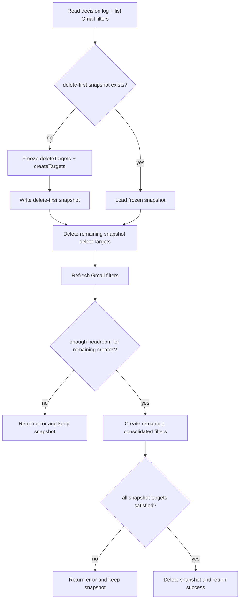

# Plan: Add lightweight resumable `--delete-first` support to `migrate-filters`

## Context

Gmail has a hard 1000-filter limit. We're at exactly 1000 filters after the newsletter review created ~986 per-sender filters. The `migrate-filters` command needs to consolidate these into ~30 grouped query-based filters, but the current create-before-delete strategy has zero headroom to create anything.

The real recovery gap is narrow:
- today, consolidated creates are only planned for senders that still have legacy per-sender filters in Gmail
- if `--delete-first` removes those filters and the process dies before create completes, a rerun would see no legacy filters and create nothing

That gap does not require a full run-state machine. The minimal reliable fix is:
- freeze the exact delete targets and consolidated create targets before the first delete
- persist that frozen plan to disk
- on rerun, reuse that frozen plan instead of re-planning from partially-mutated Gmail state

This keeps the implementation proportional to the problem while still making delete-first resumable.

## Design

Keep the existing create-before-delete path unchanged.

Add a delete-first path that uses a single frozen snapshot file:

`<dataDir>/filter-migrations/delete-first.json`

`dataDir` is derived from `decisionLogPath`, so the snapshot sits next to the rest of the durable local state.

### Snapshot shape

Keep this local to `filter-consolidator.ts` unless it becomes reusable elsewhere:

```typescript
interface DeleteFirstPlan {
  version: 1;
  strategy: "delete-first";
  createdAt: string;
  noiseLabelId: string;
  deleteTargets: Array<{
    filterId: string;
    senderEmail?: string;
    kind: "legacy-noise" | "stale-keep";
  }>;
  createTargets: Array<{
    query: string;
    senders: string[];
    removeLabelIds: string[];
  }>;
}
```

Important rule:
- `createTargets` must be frozen from the initial legacy sender set before any deletes happen
- reruns must reuse the snapshot if it exists
- do not rebuild delete-first `createTargets` from whatever legacy filters happen to remain later

## Execution model



### Why this is enough

The snapshot handles the only true planning gap:
- after deletes, live Gmail no longer tells us what replacements were intended

Everything else can rely on existing idempotency:
- if a consolidated filter already exists, skip it
- if a snapshot delete target no longer exists, treat it as already deleted
- if the process dies mid-run, rerunning the same command recomputes "remaining work" from the snapshot plus current Gmail state

## Files to modify

| File | Change |
|------|--------|
| `inbox-zero/src/noise/filter-consolidator.ts` | Add `deleteFirst` support, snapshot helpers, projected headroom, hard failure semantics |
| `inbox-zero/tests/noise/filter-consolidator.test.ts` | Add delete-first resume and failure-window coverage |
| `inbox-zero/src/cli.ts` | Add `--delete-first` flag and operator messaging |

No new schema module, no new manager module, no run IDs, no `--restart` flag.

## Steps (TDD order)

### Step 1: Add delete-first snapshot helpers

In `src/noise/filter-consolidator.ts`, add small local helpers:
- `getDeleteFirstPlanPath(decisionLogPath)`
- `readDeleteFirstPlan(filePath)`
- `writeDeleteFirstPlan(filePath, plan)`
- `deleteDeleteFirstPlan(filePath)`

Requirements:
- write via `atomicWriteFile()`
- missing snapshot means "no active delete-first plan"
- corrupt snapshot is fatal

### Step 2: Extend `MigrateFiltersOptions`

```typescript
export interface MigrateFiltersOptions {
  mode: "dry-run" | "execute";
  /** Delete per-sender filters before creating consolidated replacements. */
  deleteFirst?: boolean;
}
```

The default path remains create-before-delete.

### Step 3: Freeze planning before the first delete

For `deleteFirst: true`:

1. Build `deleteTargets` from current live Gmail filters:
   - stale keep-filters
   - legacy per-sender noise filters
2. Build `createTargets` from the frozen legacy-noise sender set that those filters represent
3. Persist the snapshot before mutating Gmail

Do not build `createTargets` from the full decision log. That would change product behavior by creating filters for every historical noise sender, while the current migration only replaces existing legacy filter coverage.

### Step 4: Reuse the snapshot on rerun

If `delete-first.json` exists:
- load it
- skip live re-planning of delete-first targets
- list current Gmail filters and compute remaining work from:
  - snapshot delete targets still present in Gmail
  - snapshot create targets not yet satisfied by an equivalent consolidated filter

This is the resumability mechanism. It replaces the need for a run manager or per-target status tracking.

### Step 5: Fix dry-run semantics

Do not simply suppress the current headroom error.

For delete-first dry-run compute:
- `wouldDelete = snapshot-or-planned deleteTargets.length`
- `wouldCreate = number of snapshot-or-planned createTargets not already satisfied`
- `projectedFilterCountAfterDeletes = existingFilters.length - wouldDelete`
- `projectedHeadroomAfterDeletes = MAX_GMAIL_FILTERS - projectedFilterCountAfterDeletes`

Dry-run should:
- ignore the create-before-delete headroom error because it does not apply
- still report an error if `wouldCreate > projectedHeadroomAfterDeletes`

### Step 6: Make execute mode truly resumable

`migrateFilters(..., { mode: "execute", deleteFirst: true })` should:

1. Load existing snapshot if present, otherwise build and persist a new one
2. Delete all remaining snapshot delete targets first
3. Treat "filter already missing" as already deleted
4. Refresh Gmail filters after deletes
5. Recompute actual remaining creates and actual post-delete headroom
6. If headroom is still insufficient, return `ok: false` and keep the snapshot
7. Create all remaining consolidated filters
8. If any create fails, return `ok: false` and keep the snapshot
9. Refresh Gmail filters once more
10. Verify against live Gmail state that no snapshot delete targets still exist
11. Verify against live Gmail state that every snapshot create target is now satisfied
12. Only when all snapshot targets are satisfied, delete the snapshot and return `ok: true`

Why `ok: false` on incomplete create/delete cleanup:
- after delete-first, missing consolidated filters are a real coverage gap
- lingering legacy filters mean the migration did not actually free the intended slots

### Step 7: Handle missing-filter deletes explicitly

Current `deleteFilter()` returns an error on API failures, including 404/not found. For delete-first resume logic, that should be interpreted inside `migrateFilters()` as "already deleted" rather than a hard failure.

Do not change the general Gmail client contract for this plan. Keep that normalization local to the migration command.

### Step 8: Add regression tests for the real failure windows

Add these tests in `tests/noise/filter-consolidator.test.ts`:

1. **Execute mode at 1000 filters succeeds** — deletes happen before creates
2. **Delete-first dry-run suppresses create-before-delete headroom error but still checks projected post-delete headroom**
3. **Resume after all deletes but before creates** — rerun loads snapshot and still creates the frozen consolidated filters
4. **Resume after partial creates** — rerun skips already-existing consolidated filters and creates only the missing ones
5. **Already-missing delete target is treated as resolved on rerun**
6. **Create failure after delete returns `ok: false` and leaves snapshot in place**
7. **Snapshot is removed only after all delete and create targets are satisfied**
8. **Corrupt snapshot is fatal**

### Step 9: Add CLI flag and messaging

In `src/cli.ts`:
- add `.option("--delete-first", "Delete per-sender filters before creating consolidated replacements")`
- pass `deleteFirst: opts.deleteFirst === true`
- when active, log whether the command is:
  - starting a new delete-first migration
  - resuming an existing delete-first migration from snapshot
- when returning `ok: false` for incomplete delete-first work, print the snapshot path so reruns are obvious

## Verification

```bash
cd inbox-zero

# 1. Run focused tests
npm test -- --run tests/noise/filter-consolidator.test.ts

# 2. Run full suite
npm test

# 3. Dry-run the delete-first strategy
GOOGLE_SERVICE_ACCOUNT_KEY=.secrets/service-account.json GMAIL_USER=you@example.com \
  npm run cli -- migrate-filters --delete-first --dry-run

# 4. Execute the migration
GOOGLE_SERVICE_ACCOUNT_KEY=.secrets/service-account.json GMAIL_USER=you@example.com \
  npm run cli -- migrate-filters --delete-first --execute

# 5. If interrupted, rerun the same command to resume from snapshot
GOOGLE_SERVICE_ACCOUNT_KEY=.secrets/service-account.json GMAIL_USER=you@example.com \
  npm run cli -- migrate-filters --delete-first --execute
```

## Notes for implementation

- Keep the default create-before-delete path as-is.
- The only new durable state should be the frozen delete-first snapshot file.
- Do not expand delete-first creates to every noise sender in the decision log.
- Do not treat create failures after delete-first as warnings.
- Do not silently ignore a corrupt snapshot. Fail fast and force manual inspection.
- Do not drop the final Gmail verification pass before deleting the snapshot. API success alone is not the same thing as confirmed final state.
