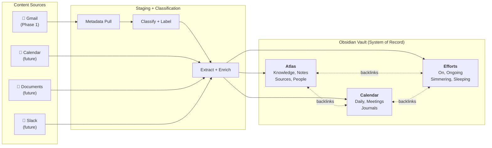
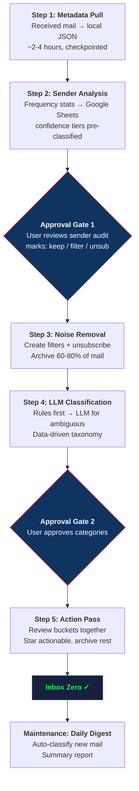

# Gmail Inbox Zero — Phase 1 Design Spec

## Context

The mailbox under review has 100k+ emails across all mail (not just inbox) with no meaningful labels or filters. Some mail is forwarded from other accounts. This is the first project in building a personal AI chief of staff system. The user has ~2 weeks off starting 2026-03-17.

**The goal is not just cleanup — it's building the foundation for autonomous email management.** Phase 1 achieves inbox zero and establishes the infrastructure. Phase 2 extracts valuable content into an Obsidian second brain. Phase 3 (future) enables AI-driven triage and eventually auto-response.

### Scope Boundary

- **In scope:** All received mail in the account (`in:anywhere -in:spam -in:trash -in:drafts -in:sent`)
- **Out of scope:** Spam, trash, drafts, sent mail (sent mail is preserved for Phase 3 communication style modeling but excluded from the triage/cleanup pipeline — including it would skew the sender leaderboard and filter rules with outgoing mail)
- **Actionable window:** Emails from the last 12 months may be flagged as actionable. Anything older is reference or archive only.

## Architecture

### Gmail Is Staging, Obsidian Is the System of Record

Gmail is a flat filing cabinet — a content source, not the organizational system. Labels are a staging mechanism for extraction. The real value lives in Obsidian's knowledge graph, where a single email can link to a person, a property, a tax year, and a project simultaneously.

```
Gmail (flat, labels)           Obsidian (graph, links)
─────────────────────          ─────────────────────────
  content source #1    ──→     Content Commons (second brain)
  [future: calendar]   ──→          ↑
  [future: docs]       ──→     People ←→ Projects ←→ Domains
  [future: slack]      ──→          ↑         ↑
                               Tags, backlinks, MOCs
```

### Content Commons Architecture



### Sync Model: Gmail ↔ Obsidian

- `_extracted` label on Gmail marks emails pulled into Obsidian
- `source-id` frontmatter on Obsidian notes stores Gmail message/thread ID
- Pattern extends to future content sources (calendar, docs, etc.)

## Tooling Stack

### Gmail Access
- **`gws` CLI** (`@googleworkspace/cli`) — operator-facing Workspace access for ad-hoc queries, auth smoke tests, label inspection, one-off Sheets checks, and fast experimentation where writing code is unnecessary
- **Gmail API via Node.js** (`googleapis` package) — productionized bulk operations: metadata pull, checkpointed body pull, batch labeling, filter creation, unsubscribe triggers
- **Gmail MCP** (Claude.ai integration) — interactive triage sessions. Needs re-authorization with Gmail read/write scopes.
- **Google Sheets API** — write sender audit reports for user review, read back decisions, and support typed/testable automation inside the maintained pipeline

### Infrastructure
- **GCP project:** configure a local GCP project with Gmail API access
- **Gmail API** must be enabled in this GCP project
- **Language:** TypeScript (strict mode, Zod schemas, TDD) — consistent with established project standards
- **Repository:** `house-keeping`
- **Phase 1 working directory:** `inbox-zero/`
- **Tooling boundary:** use `gws` where it simplifies one-off operator work; use direct Google APIs for anything high-volume, resumable, typed, or part of the maintained automation path

### Open Source Tools
- `gmail-unsubscribe` (Google Apps Script) — for executing unsubscribes at scale
- Gmail native Manage Subscriptions (July 2025 feature) — for supported senders
- Google's official Gmail API docs for rate limits, pagination, bounded concurrency, and supported batch write operations (must be researched before implementation via Context7/Google MCP)

## Triage Workflow Overview



## Triage Workflow

### Step 1: Metadata Pull

**What:** Pull metadata for all received messages in the account (excluding spam, trash, drafts, and sent mail).

**Fields per message:**
- Message ID, Thread ID
- Sender (email + display name)
- Recipients (to, cc)
- Subject line
- Date received
- Gmail category (Primary/Social/Promotions/Updates/Forums)
- Labels (existing)
- Read/unread status
- Snippet (first ~100 chars, no full body yet)

**Implementation requirements:**
- **Full checkpointing** — save progress every 500 messages. On failure, resume from last checkpoint. At 100k+ messages and Gmail rate limits, a failure without checkpointing means restarting from zero.
- **Pagination + bounded concurrency** — page through `messages.list`, then fetch metadata with bounded concurrent `messages.get` calls. Use `batchModify` only for write operations that actually support batching.
- **Output:** JSON files in `inbox-zero/data/`, chunked by checkpoint batch. A manifest file tracks pull progress and completion status.

**Important constraint:** attachment presence is not reliably available in Gmail's metadata-only responses. Attachment-related signals are deferred until later body/full-content pulls for the smaller post-noise dataset.

**Estimated time:** 2-4 hours depending on account size and rate limits.

### Step 2: Sender Frequency Analysis + Audit Report

**What:** Process the metadata dump and produce a Google Sheets audit report.

**Analysis outputs:**
- Sender leaderboard — all unique senders ranked by email volume
- Category breakdown — count per Gmail category (Primary/Social/Promotions/Updates/Forums)
- Time distribution — emails per month, showing inbox growth patterns
- Notification senders — automated/noreply addresses grouped separately

**Google Sheets audit report columns:**
| Column | Description |
|--------|-------------|
| Sender email | Full email address |
| Sender name | Display name |
| Email count | Total messages from this sender |
| First email date | When they first emailed |
| Last email date | Most recent email |
| Gmail category | Primary/Social/Promotions/Updates/Forums |
| Unread ratio | % of their emails still marked unread (proxy for engagement — high unread = likely ignored) |
| Thread count | Number of distinct threads (vs single messages) |
| Sample subjects | 3-5 representative subject lines |
| Confidence tier | Pre-classified: definitely noise / probably noise / probably keep / definitely keep |
| Recommended action | My recommendation: keep / filter / unsubscribe |
| Surprises flag | Flagged if the sender pattern is unexpected (e.g., high-volume but Primary) |
| **Your decision** | _Empty — you fill this in: keep / filter / unsubscribe_ |

**Confidence tiers (pre-classified by the system):**
- **Definitely noise:** noreply@, marketing domains, known newsletter platforms, Gmail category = Promotions/Social with high unread ratio
- **Probably noise:** High unread ratio, notification-style subjects, automated patterns, low thread spread
- **Probably keep:** Primary category, lower unread ratio, some recency, human sender patterns
- **Definitely keep:** Low unread ratio, recent activity, multi-thread history, human/important sender pattern

User reviews the sheet. Focus on the middle tiers — spot-check the extremes. This is **Approval Gate 1**.

### Step 3: Noise Removal

**Triggered after user completes the audit sheet.**

For senders marked `unsubscribe`:
- Execute unsubscribe via `gmail-unsubscribe` Apps Script or Gmail's native Manage Subscriptions
- Create Gmail filter: `from:sender@example.com` → skip inbox, apply `_noise` label, mark as read
- Apply filter retroactively to archive historical emails from this sender

For senders marked `filter`:
- Create Gmail filter: skip inbox, apply `_noise` label (no unsubscribe — user wants to keep receiving but not in inbox)
- Apply retroactively

For senders marked `keep`:
- No action. These stay in the pipeline for Step 4 categorization.

**Nothing is deleted.** Noise emails are archived under `_noise` label. They can be recovered.

**Expected outcome:** 60-80% of all mail cleared from inbox in one pass.

### Step 4: LLM-Assisted Categorization

**What:** Classify the remaining emails (after noise removal) into meaningful categories.

**Pre-processing — volume reduction:**
1. **Thread-level collapse** — group by thread ID, classify at thread level (not individual message level). Reduces volume 3-5x.
2. **Smart content extraction** — for each thread, extract only unique/new content per message (strip quoted replies). Send the distilled thread to the LLM, not the full redundant chain.
3. **Deterministic rules first** — after Step 2, we know the high-volume keep senders. Bootstrap sender/domain rule candidates from that audit, curate the rules file, then apply approved rules before any LLM call.

**LLM classification (for unmatched/ambiguous only):**
- **Provider-agnostic pipeline** — classification function accepts a provider parameter. User decides which LLM handles which content type.
- **Tiered approach:** cheap/fast model (Haiku) for semi-obvious cases, full model (Sonnet/Opus) for truly ambiguous content
- **Classification output per thread:**
  - Primary category (data-driven — categories emerge from the data, not pre-defined)
  - Confidence score
  - Actionable flag (yes/no) — only if within 12-month window
  - Brief summary (1-2 sentences)

**Category taxonomy is data-driven.** The LLM proposes categories based on what it sees in the actual email content. After processing a representative sample (first 1000 threads), the system presents proposed categories plus the curated deterministic rules file for user approval before classifying the rest. This is **Approval Gate 2**.

**Data retention:** After classification, keep local copies of emails in interesting categories (for Phase 2 extraction). Purge local copies of noise/archive emails — if needed later, re-pull from Gmail.

**Gmail label application:** Apply approved category labels to all classified emails. Labels are created from the approved taxonomy, not pre-defined. Non-actionable/reference mail is archived immediately. Actionable mail receives its category label plus `_triage` and stays in inbox until Step 5 review.

### Step 5: Action Pass

**Interactive session — user and AI review together.**

For each non-archive category:
- **Actionable** (within 12-month window) — review each item, star what needs response, archive the rest
- **Project categories** (tax, rental, financial, etc.) — these become the extraction source for Phase 2
- **Reference** — archive with label, available for future retrieval

**Inbox zero is achieved when:** every message has at least one label and is either starred (needs action), archived (categorized), or filtered (noise).

## Operational Labels

Only three pre-defined labels. Everything else emerges from the data.

| Label | Purpose | Lifecycle |
|-------|---------|-----------|
| `_noise` | Filtered junk (with auto-discovered subcategories) | Permanent — filters keep applying |
| `_triage` | Temporary marker during cleanup process | Removed after Phase 1 completion |
| `_extracted` | Marks emails pulled into Obsidian (Phase 2) | Permanent — sync tracking |

## Maintenance Mode (Post-Inbox Zero)

**Daily digest script** — runs on a schedule (cron or similar):
1. Pulls metadata for new received mail since the last run, applies deterministic rules first, and only pulls bodies/threads for ambiguous cases
2. Applies labels and filters using the same Step 4 pipeline
3. Generates a summary of what arrived and what was auto-handled
4. Leaves actionable new mail in inbox with `_triage`, auto-archives non-actionable mail, and delivers the summary via email or Obsidian daily note (Phase 2)

## Timeline

| Day | Milestone |
|-----|-----------|
| **1** | Project bootstrap — enable Gmail API in GCP, scaffold TS project with Zod schemas, auth smoke tests, checkpointing infrastructure, dry-run mode |
| **2** | Metadata pull script complete + run. Full checkpointed pull of all mail. |
| **2-3** | Sender analysis + Google Sheets audit report generated |
| **3-4** | **Approval Gate 1** — user reviews sender audit sheet |
| **4-5** | Noise removal executed — filters, unsubscribes, retroactive archive. 60-80% cleared. |
| **5-8** | LLM categorization — deterministic rules first, then tiered LLM for remainder. Category taxonomy proposed + approved. |
| **8-9** | **Approval Gate 2** — user reviews categorization report |
| **9-10** | Action pass — interactive triage, inbox zero achieved |
| **11-14** | Phase 2 kickoff — Obsidian vault setup + extraction pipeline |

Timeline is upper bounds — milestones pull forward if ahead of schedule.

**Day 1 explicitly includes:** project scaffold, auth smoke tests, schema design, checkpointing infrastructure, and dry-run support. No metadata pull attempt until these are solid.

## Success Criteria

**Phase 1 is done when:**
1. Every email in the account is archived with a label, starred for action, or filtered out of inbox
2. Noise is permanently handled — filters block future junk, unsubscribes executed for approved senders
3. Data-driven labels applied — categories emerged from actual content, not pre-assumed
4. Local data retained for interesting categories — ready for Phase 2 extraction
5. `_extracted` sync model ready — label exists, sync metadata schema documented
6. Daily digest maintenance script operational — new mail classified automatically
7. Google Sheets audit trail preserved — decisions are documented and reviewable

**Phase 1 is NOT:**
- Building the Obsidian vault (Phase 2)
- Extracting content into markdown (Phase 2)
- People/entity enrichment (Phase 2)
- Auto-responding to emails (Phase 3)
- Responding to or actioning every email — just categorizing and clearing

## Verification

- Run metadata pull script and confirm all messages captured (cross-check count against Gmail UI)
- Generate sender report and verify top senders match reality (spot-check against Gmail)
- After noise removal, verify inbox count dropped 60-80%
- After LLM categorization, spot-check 50 random emails across categories for correct classification
- Confirm all emails have at least one label and are out of inbox
- Confirm daily digest script runs and produces a summary
- Confirm `_extracted` label exists and sync metadata schema is documented

## Phase 2 Context (for reference)

**Obsidian vault framework:** ACE (Nick Milo) as skeleton — Atlas/Calendar/Efforts.
**Templates:** Dann Berg's people/meeting/daily note patterns.
**Multi-source capture:** Nicole van der Hoeven's automated pipeline approach.
**Official CLI:** Obsidian CLI v1.12.4+ for scripted note creation.
**Bootstrap principle:** Don't over-build structure. Let Phase 1 data inform the vault's shape.

Key resources:
- [ACE framework](https://blog.linkingyourthinking.com/notes/ace-folder-framework)
- [Dann Berg templates](https://dannb.org/blog/2022/obsidian-people-note-template/)
- [Nicole van der Hoeven vault](https://notes.nicolevanderhoeven.com/Fork+My+Brain)
- [Obsidian CLI docs](https://help.obsidian.md/cli)
